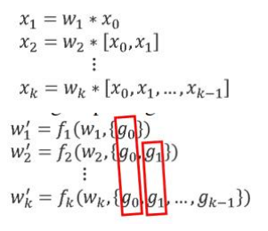
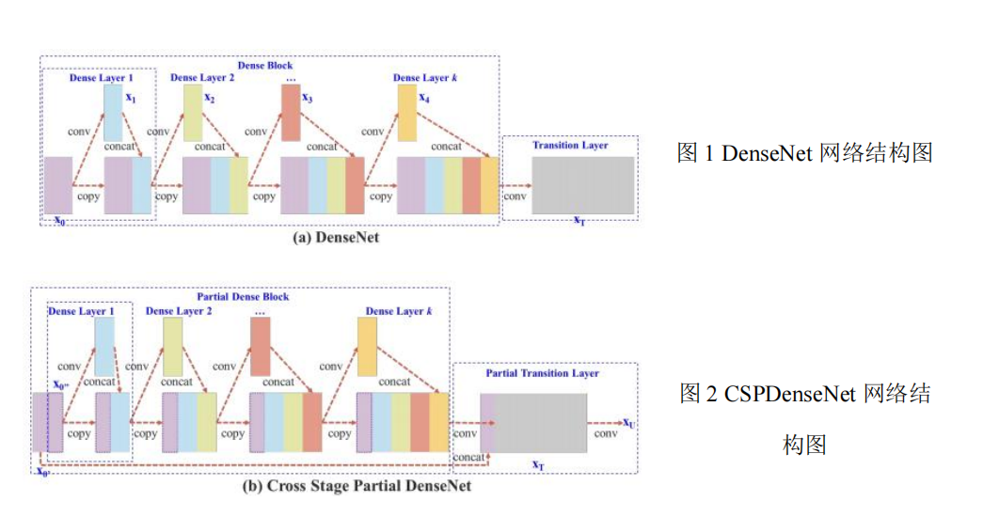
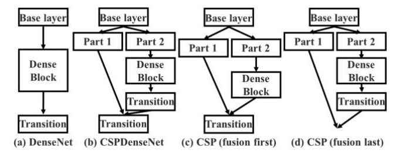

一、背景

卷积神经网络随着宽度和深度的加大时，性能也随之增强。但这同时会导致计算量增加，在小型设备上的轻量计算逐渐受到大家的广泛关注，但轻量化会降低模型准确率，这给计算机视觉算法带来了很大的挑战。同时，作者希望能够提高每个算数单元的利用率，减少瓶颈，以及减少存储代价。

ResNet 将前面某一层的特征通过跳跃连接到当前层，进行特征相加。DenseNet 将前面每一层的特征都连接到当前层。以上做法避免了层数增加梯度的衰减，实现了特征复用。但是，同时存在梯度信息冗余的问题。为了去冗余，减少计算量，作者提出了 CSPNet 网络。

二、方法

（1）跨阶段局部网络

残差模块将前面某一层的特征与当前层特征激活后相加；密集模块将前面所有层的特征与当前层特征激活后合并。

密集模块每层输出特征，以及反向传播时权重更新包含的梯度信息表示如下：

红色框线表示每次权重更新时，包含了相同的梯度信息，即存在信息冗余。

CSPDenseNet

CSPDenseNet 是将输入特征分为两部分，一部分进行映射后与另一部分进行通道合并。反向传播时，每部分的权重更新不包含冗余的梯度信息。

下图分别是 DenseNet 与 CSPDenseNet 的网络结构。其中，DenseNet 将相同的输入特征，分别送入 Dense Layer 进行操作后与先前相同的输入特征进行通道合并，重复该操作。最后进行 Transition 操作。

而 CSPDenseNet 则是将输入特征的一部分送入到 Dense Layer 操作（由于只选了一部分，因此减少了相同信息的冗余），然后将结果与先前的全部输入特征进行通道合并，重复进行。

完成上述步骤后，将输出与最先的一部分输入特征进行合并，然后进行 Transition 操作。最后进行卷积得到最终的输出特征 Xu。

（2）特征融合

DenseNet 在特征通道合并后进行 Transition 操作，而 CSPNet 则是在将一部分特征先送入 Dense Layer 再进行 Transition 后，再与先前特征进行合并，然后再同时进行 Transition 操作。下图，构造了几种不同位置的特征通道合并结构。图 c 在 Transition 前进行特征融合，会损失大量的梯度信息。图 d 在 Transition 后进行特征融合，避免了重复的梯度信息流动。

总结

CSPNet 保留了 DenseNe 和 ResNet 的特征复用，但是提出梯度信息截断，通过使用一部分特征取代全部特征进行合并，减少了相同信息的冗余。