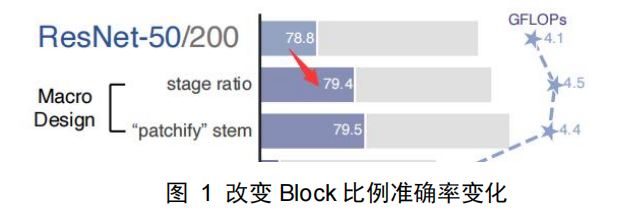

一、背景

深度学习在过去十年间有着里程碑式的进展，主要是由神经网络的复兴作为驱动力。十年间，视觉识别领域由特征工程转变为网络结构的设计。随着视觉领域的快速发展，人们关注的指标不只有精确度，还有效率、可扩展性等多方面。

在 NLP 领域，Transformer 逐渐取代了 RNN 作为主干网络。尽管 NLP 和视觉领域任务不同，但两种主流在 2020 年汇聚到了一起，提出了用于视觉领域的 ViT。ConvNets 和 ViT有着相似的归纳偏置，但在训练过程以及宏观/微小水平的结构设计上不同。因此，作者想研究两者之间结构设计的区别，测试出 ConvNets 的局限性，以及 ViT 的策略是如何影响ConvNets 性能，所以这篇文章的工作就是在 ConvNets 上使用了 ViT 的策略。 

二、方法

作者选用 ResNet 作为基准网络

1.Training Techniques

第一步是使用训练 ViT 的策略来训练 ResNet。原来在 ResNet 上 epochs 为 90，现在是300，并且使用 AdamW 优化器，数据增强等方法。进行了这种策略替换之后，准确率由 76.1%变为 78.8%

2..Macro Design

Changing stage compute ratio

Swim-T 每一阶段的 Block 数量比例为 1：1：3：1，而 ResNet 为（3，4，6，3），即 1：1：2：1，因此将其改为（3，3，9，3），实现和 Swim-T 一样的比例。这种改变使得模型准确率由 78.8%提升为 79.4%，如图 1。

Changing stem to Patchify

在原先的卷积神经网络，下采样使用 7x7 卷积和 4x4 池化层（stride 均为 2）。但在 ViT中，使用非常大且无重叠的卷积层。Swim-T 使用 4x4，stride=4 的卷积。作者将 Swim-T 这种方法应用到 ResNet 中，准确率由 79.4%变为 79.5%，如图 2.

3.ResNeXt-ify

作者采用分组卷积，即每个特征对应一个卷积核。同时，将 ResNet 原本的 64 个通道，变为和 Swim-T 一样的 96 个通道。这让准确率提升到 80.5%，并且将 FLOPs 增加到 5.3G，如图 3。

4.Inverted Bottleneck

ResNet 的隐藏层维度是输入和输出维度的 1/4，MobileNetV2 的隐藏层维度是输入和输出维度的 4 倍。作者认为 Swim-T 的 MLP 和 MobileNetV2 的 Bottleneck 有关联，因此在ConvNet 中也采用了同样的策略，准确率由 80.5%变为 80.6%，如下图所示。

5.Large Kernel Sizes

- Moving up depthwise conv layer

由于在 Transformer 中，MSA 在 MLP 前面，因此作者将 depthwise 卷积层上移。该操作将 FLOPs 减小到 4.1G，准确率降为 79.9%。

- Increasing the kernel size

将 Swim-T 中的大卷积核用到 ConvNet 中，并依次尝试了 3，5，7，9，11，但是 7x7卷积核就到达了饱和，因此最后选取 7x7 卷积核。准确率由 79.9%提升到 80.6%

6 Micro Design

Swim-T 中，只在 Block 的最后一层卷积前采用 GELU 作为激活函数，因此 ConvNet 也将 GELU 使用在 Block 最后一个卷积层前。

由于 BN 在 NLP 领域不适用，所以 Swim-T 使用 LN 代替。同样的，Swim-T 只在 Block的倒数第二个卷积层前使用 LN，故 ConvNet 也同样如此。

ResNet 在每个阶段使用 3x3,stride=2 的卷积进行下采样，Swim-T 使用单独的下采样层。所以 ConvNet 同样的，使用 2x2，stride=2 卷积。

上述步骤，如下图所示，并且精确率最终提升为 82%。

7.ConvNet变体

下图为 ConvNet 的变体，C 表示通道数，B 表示每个阶段的 Block 数量。 

作者在不同的数据集上与 Swim-T、B、S，ViT 进行对比，验证了其策略用在卷积网络上也可以取得不错的性能。网络的优越性不一定在于结构上，也可能在于算法策略。