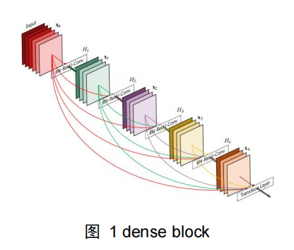
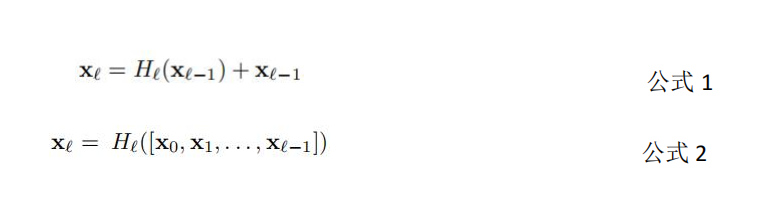
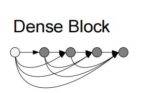
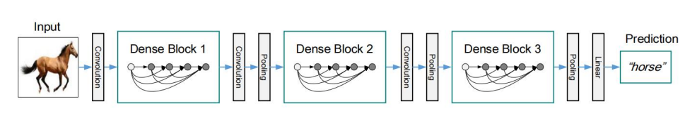

DenseNet： 

一、背景

ResNet 通过跳跃连接，将较低维度的特征送入更深的层进行融合，使得反向传播时每

次梯度计算有一个较大的值，避免了梯度求导连乘越来越小的问题。本篇论文受 ResNet 启

发，用更密集的跳跃连接对 ResNet 进行改进，使得每层都有来自前面所有层的输入特征进

行合并，包含了 L(L+1）/2 个连接，如下图。

二、方法

（1）Dense Block

该模块是在残差模块的基础上，将前面所有层的特征都连接到了当前层进行合并，实现了特征复用。公式 1 是残差模块的表示，只将前面某一层的特征输入到当前层；公式 2 表示密集模块，是将包含当前层之前的所有层特征分别融合，再经过非线性函数映射。其中，非线性函数可能是包含 BN，Relu，3x3 卷积的一系列操作。

（2）DenseNet

基本的 DenseNet 结构

DenseNet 是由三个密集连接块以及相邻连接块之间的卷积，池化组成。其中，相邻的Dense Block 之间的卷积池化操作是为了维持输入特征的维度，如图 所示。

DenseNet-B

如果映射函数 HL输出 k 个特征图，即通道数为 k，则 L 层输入有 k0+k*(L-1)个特征。其中 k0是输入特征图的通道数。当层数非常大时，每层都是接受来自前面每一层的特征输入，计算量非常大，因此作者将 1x1 卷积引入原来的密集块结构，提出 Bottleneck 层，称之为DenseNet-B。

DenseNet-C

两个相邻的 Dense Block 之间的卷积池化操作，称为 Transition 层。引入压缩系数θ（0-1）到该层，使得特征经过 Transition 层得到压缩。θ越小，特征压缩程度越大。使用了该压缩方法的 DenseNet 称为 DenseNet-C。 

三、实验及结果

作者将提出的 DenseNet，DenseNet-B，DenseNet-C 网络与 ResNet 在多个基准数据集上进行了对比实验，验证了方法的精确，且减少了参数量。 

四、总结

（1）很多文章提出的方法，对需要多次进行堆叠的结构或分支采用相同的参数和操作，减少参数量和复杂度。比如 ResNeXt 对每一个 Inception 分支采用相同的卷积等参数，Alex上下两个网络结构采用的也是一样，这篇论文的 Dense Block 和 Transition 层也是一样的操作反复使用。后续设计模块的时候也可以考虑相同的方法。

（2）DenseNet 解释了为什么 ResNet 好，并且把这种好的方式反复使用，加速了问题的解决，但同时带来了一些问题，又针对这些问题采取了一些措施。创新也可以采用同样的思路。