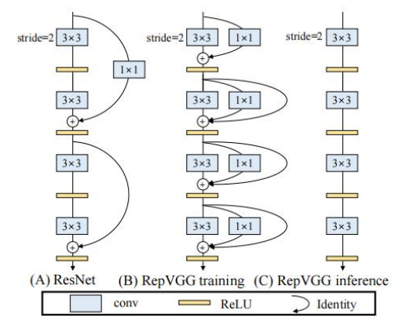
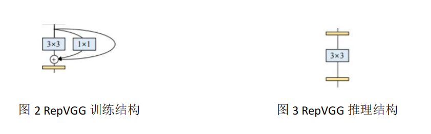
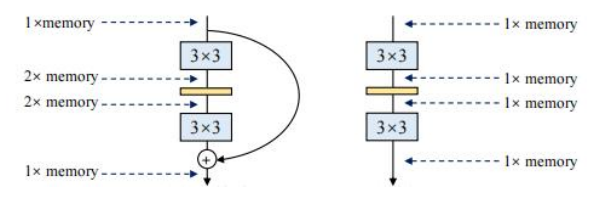
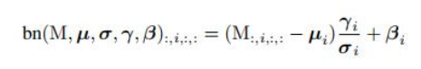
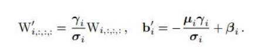
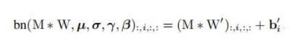
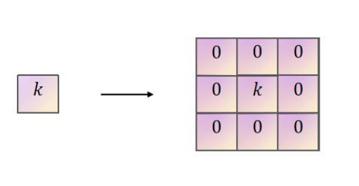
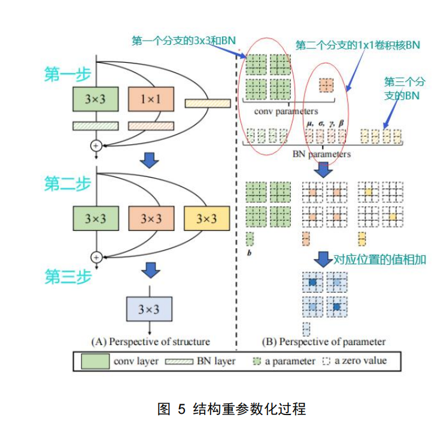

一、背景

VGG 通过堆叠一系列相同的卷积，池化，Relu 激活函数操作在图像识别领域取得巨大的成功。Inception，ResNet，DenseNet 这些网络把研究兴趣转移到了复杂模型的结构设计。

虽然这些复杂的网络相比简单的网络结构准确率更高，但同时带来了一些问题：复杂的多分支结构使得模型很难去实施或改进，减慢了推理速度，并且降低了存储器的利用率。

一些网络的模块增加了存储代价，而且还不能支持多种设备，并且 FLOPS 不能准确的反应实际的速度。有些模型虽然从 FLOPS 上低于 VGG、ResNet 网络，但是它的运行速度不如后者，因此 VGG 以及 ResNet 不管在学术或是工业上都有着很重要的地位。并且由于多分支

结构对于训练作用很大，但减慢了推理速度，作者想对训练和推理进行去耦合，因此提出了RepVGG。 

二、方法

（1）RepVGG 网络结构

RepVGG 采用了和 VGG 相同的策略，即使用相同的卷积核及步长，降低复杂性。并将这种策略和 ResNet 思想结合，因此在训练时，上一层的输出特征分别进行 3x3 卷积，1x1 卷积，BN 操作，三个分支的特征相加后进行 Relu 激活，重复以上步骤，完成训练过程。

由于多分支结构减慢了推理速度，因此推理过程采用一条路径实现，如下图：

上述操作给推理过程带来三个有效作用：

**更快**

如下图所示。左图为训练过程，含三个并联分支，每个分支都需要等待其他分支的运算结束，才能进行最终的相加操作，运算速度不一致时，会浪费算力。其中，BN 运算最快，其次 1x1 卷积，3x3 卷积最慢。因此多分支结构会使得算数单元得不到充分利用，而右图的单分支结构不需要等待其他分支，完成运算直接进入下一步操作。

**节约存储空间**

图 4 左图为多分支结构，在每个分支结果相加完成前，需要对中间的每个分支结果进行存储，因此有多少个分支，存储容量就需要扩大多少倍，直至完成相加操作后，才会回到原先所需的存储空间大小。而右图不需要额外的存储，一直对中间的输出结果进行操作即可。

**更灵活**

对模型优化，一般需要剪枝等操作，同时需要保证最后一个卷积层的张量维度相同。在这种情况下，但分支结果显然比多分支更好操作。

（2）结构重参数化

将训练结构图，变为合适的推理过程，需要进行结构重参数化来优化网络结构，如图 5所示。步骤如下：

第一步-->>第二步（每个分支的卷积与 BN 操作融合）

由于卷积核 BN 都是线性运算，因此可以合并。BN 含四个参数μ，σ 2，γ，β，其中μ，σ 2是由计算得到，γ，β是由网络反向传播更新得到。BN 计算公式如下。其中，M 表示输入特征：

重参数化后，卷积核权重和偏置更新过程如下：

图 5 中第一步到第二步，即将每个分支中，卷积后的输出特征进行 BN 操作，然后按照上述的推理 BN 进行计算，最后表示如下：

最后得到卷积和 BN 融合后的第二步过程。

第二步-->>第三步（三个分支的操作融合）

此步骤需要对 1x1 卷积核进行 padding=1 的填充（stride=1），扩充为 3x3 卷积，如下：

BN 操作相当于恒等映射后进行 BN。首先恒等映射不改变每个通道的特征值，转换为卷积需要对每个通道进行深度可分离卷积（保证卷积核总权值为 1）。选择当前通道卷积核权值为 1，其他通道为 0。相当于每个通道只将自己的特征图保持不变输出，将其他的特征图置 0 的卷积操作。然后进行上述第一步的推理 BN 操作。

再将三个分支对应位置的参数相加，完成分支融合。

（1）深度学习的发展逐渐由提出基础网络结构变为网络结构的优化，来从各方面提高模型的性能。

（2）由于恒等连接的作用之一是减小梯度衰减，而推理过程不需要更新参数的过程，因此通过去掉恒等连接，加快推理速度。

（3）可以探讨训练和推理对网络模型的其他需求区别，实现类似的去耦合。或者从其他指标提高推理的性能，而不单单是速度。

（4）作者通过不同的 RepVGG 与其他网络对比，验证了有效性。并且这篇论文补充了分支数对模型准确率影响的实验，填补了之前研究验证的空白。作者还对比了 RepVGG-A、B 系列，区别在于每个阶段重复模块的次数。 