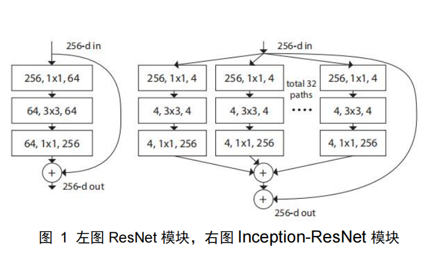
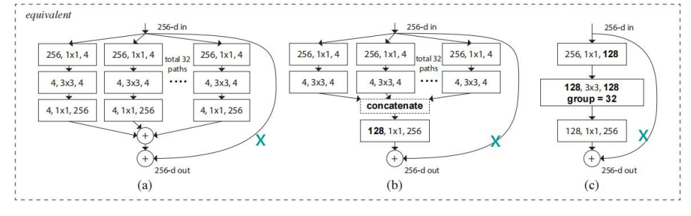
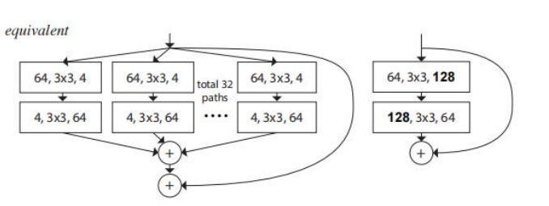

ResNeXt： 

一、背景

从机器学习到深度学习，实现了由人为设计特征，到人为设计网络结构让网络自动学习特征的转变。VGG 通过让网络的每个块参数一样，简化网络设计。ResNet 网络也采用了这种相同模块堆叠的策，减少网路的超参数，提高鲁棒性。同时 ResNet 的跳跃连接使得计算每部分的梯度时加上了一个较大的导数，这使得在网络层数较深时，避免了连乘导致梯度越来越小。

Inception 网络采用了多分支结构（分开-转变-合并策略），输入通过 1x1 卷积降低维度，再进行滤波器卷积操作，最后将各分支结果进行合并。Inception 的结构，通过增加了分支数与滤波器种类，丰富了特征，降低了参数冗余，减小计算量，提高了模型的表达能力。但是由于 Inception 支路比较多，每个支路的操作不同，使得其包含了许多超参数，导致了其很难适应到其他的数据、任务中。

由此作者提出了将 Inception 模块与 ResNet 残差结构相结合，并采用了 AlexNet 分组的思想，将卷积分组，并将 Inception 的每个分支设置成一样，减少超参数。图 1 为所提的Inception-ResNet 模块结构。

二、方法

（1）设计原则：

特征图维度相同，则共享超参数（宽度和滤波器的尺寸）

特征图下采样因子为 2，则块的宽度乘 2

（2）切分-转变-聚合

切分：将输入分成多个低维度子空间

转变：通过函数对各个子空间的输入进行运算，改变特征表示

聚合：将各个分支合特征并在一起

在本篇论文中，函数 Ti采用相同的策略。将 ResNet 的跳跃连接引入其中，

层数为 2 的 Inception-ResNet 模块

三、实验及效果

作者为了探讨分支数以及模块宽度对性能的影响，在多个数据集上，通过增加分支、层

数，与 ResNet 进行了对比实验，证明了所提方法的有效性。 

四、总结

（1）设计模块时，可以考虑多分支结构。同时，残差结构在减小计算量的同时，保持了梯度不随乘法的次数增加而衰减，从而提升性能。因此多分支和残差在设计模块时作用很大。

（2）创新点可以把多篇论文的思想结合起来，改进/设计模块，网络，形成自己的 idea。