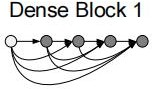

RexNet 的作用：

（1） 解决梯度衰减问题

 当网络层数加深时，随着不断地连乘，梯度会变得越来越小.一方面，需要更深的网络去学习高维语义的特征。ResNet  由于增加了跳跃连接，每次梯度更新都会加上一个较大的值，这缓解了梯度消失的问题。

（2） 差分放大器

论文中描述，原先的网络不断地去拟合 H(x)，而残差网络是拟合 F(x)=H(x)-x。假设 x=5， H(x)=5.1，那么 F(x)=0.1。此时若 F(x)=0.2，增加了 100%，则 H(x)=5.2，增加了 1%。由此说明，相比原先的网络结构，残差结构实现了差分放大器的功能，即较小的变化，可以起到很大的调整作用。

（3） 降低冗余

Relu 存在死区，可以去除掉部分特征。若这部分特征存在冗余，利用 Relu 的特性，可以实现去冗余，同时可以通过跳跃连接直接将非冗余特征进行传输，由此实现特征去冗余。

（4） 特征复用

较深层可以直接使用较浅层的特征，增加了不同层之间的特征传递。由于浅层和深层提 取到的特征不一样，浅层包含了纹理，位置等低级特征，深层包含高级语义特征，两种特征 的融合，丰富了特征的种类，可以起到平衡的作用。

ResNet 是将两条路径的特征相加；DenseNet 是当前层接收前面每一层的特征，再将多个特征拼接；CSPNet 是将特征取一半，再通过跳跃连接到较深层；

