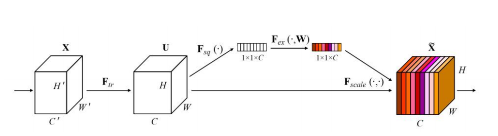
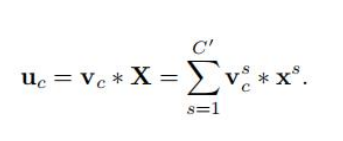
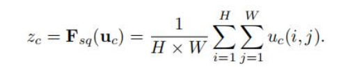
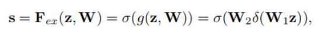
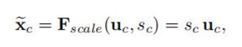
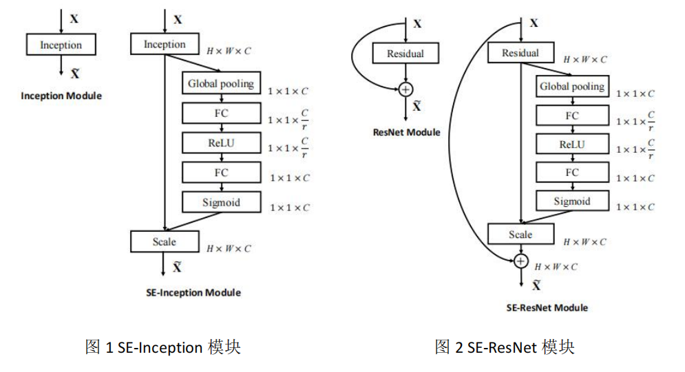

背景

在各类计算机视觉任务中，卷积神经网络展现了良好的性能。每一个卷积层在一个局部的感受野内，提取了特征的局部关联性。为了提升网络的表达能力，作者想利用通道之间的相互依赖性，以及全局信息去强调那些有用的特征，由此提出了 SE 模块。其中，包含了Squeeze 操作和 Excitation 操作。

方法

卷积操作如下。其中，vc是一个 2D 的卷积核，*代表卷积操作，C’表示卷积核个数，X 为输入，uc为输出特征。

（1）Squeeze 操作

Squeeze 操作，就是对特征进行全局平均池化（如公式 2 表示），提取特征的全局分布信息。该方法能够增强有用的特征。

其中，H，W 是特征的空间维度。这一步将 H*W*C 维度的特征压缩到 1*1*C，并且在全局

进行压缩，感受野由局部变为全局。

（2）Excitation 操作

这个操作有两个原则：足够灵活，不存在互斥关系。该操作公式表示如下，其中，δ代表 Relu 函数，ω1和ω2分别代表两个全连接的权重矩阵，σ代表 sigmiod 激活函数。r 表示降维率。

通过为每个卷积核生成权重 s，表现通道间的相关性及重要性。再将每个通达上的权重与到该通道的特征相乘，进行特征的缩放xc。

（3）SE 与其他模块的融合

该结构中，平均池化表示 Squeeze 操作，FC-Relu-FC-Sigmoid 表示 Excitation 操作。两个全连接进行特征交互，从而提高通道间的相关性；Relu 非线性激活函数提高非线性能力；Sigmoid 将最终权重缩放到 0-1 之间。

