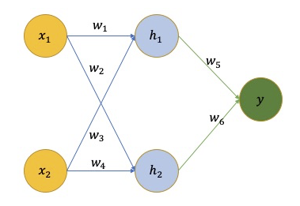

## 1.基本概念

BP(Back Propogation)算法是一种最有效的学习方法，主要特点是**信号前向传递，而误差后向传播**，通过不断调节网络权重值，使得网络的最终输出与期望输出尽可能接近，以达到训练的目的。前向过程中通过与正确标签计算损失，反向传递损失，更新参数，优化至最后的参数。

而面试的过程中，我们可以拿出一支笔，给面试官直接说，“**老师，我来直接写一个吧，您看看呗？**”

“你看哈，我这一个两层的神经网络。其中$x$是网络的输入，$y$是网络的输出，$w$是网络学习到的参数。"

“在这里，$w$的值就是我们需要更新的目标，但是我们只有一些$x$与跟它对应的真实$y=f(x)$的值，所以呢？我们需要使用这两个值来计算$w$的值了，整个问题就转变成了下面的优化问题了，也就是我们需要求函数的最小值。”

在实际中，这类问题有一个经典的方法叫做梯度下降法。意思是我们先使用一个随机生成的$w$，然后使用下面的公式不断更新$w$的值，最终逼近真实效果。

$$w^{+}=w-\eta \cdot \frac{\partial E}{\partial w}$$

这里$w$ 是一个随机初始化的权重，$\frac{\partial E}{\partial w}$是表示当前误差对权重$w$的梯度。$\eta$是表示的学习率，通常不会很大，都是0.01以下的值，用来控制更新的步长。

## 2. BP基础之链式求导

若$y=g(x)$, $z=f(y)$,那么$z=h(x)$,其中 $h=f \circ g$。其中$\frac{d y}{d x}=g^{\prime}(x), \frac{d z}{d y}=f^{\prime}(y)$。

当我们需要求$z$对$x$的导数$\frac{d z}{d x}$就需要使用链式求导了。根据我们之前学过的知识：

$$h^{\prime}(x)=\frac{d z}{d x}=\frac{d z}{d y} \cdot \frac{d y}{d x}$$

这里说的都还是以单变量作为例子，实际中，多维变量就是变成了求偏导数了。

## 3. 参考
- https://blog.csdn.net/qq_43196058/article/details/102670461
- https://zhuanlan.zhihu.com/p/40378224
- https://zhuanlan.zhihu.com/p/21407711
