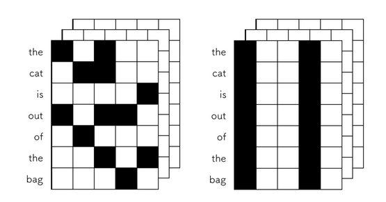

### Dropout
目前来说，$Dropout$有两种。第一种就是传统的$Dropout$方案。另一种，就是我们的吴恩达老师所讲的$Inverted$ $Dropout$了。
这两种方案本质上没什么区别，在实现的过程中是有区别的，接下来我们会详细进行比较。

这里先给出其数学公式：

$Training$ $Phase$ :
$$
\mathbf{y}=f(\mathbf{W} \mathbf{x}) \circ \mathbf{m}, \quad m_{i} \sim \operatorname{Bernoulli}(p)
$$
$Testing$ $Phase$ :
$$
\mathbf{y}=(1-p) f(\mathbf{W} \mathbf{x})
$$

首先，看下$Dropout$论文中给出的图像，了解下$Dropout$究竟干了个啥。


概括来说：**Dropout提供了一种有效地近似组合指数级的不同经典网络架构的方法。**

将$Dropout$应用到神经网络中，相当于从该网络中采样一些子网络。这些子网络由所有在$Dropout$操作后存活下来的单元节点组成。如果一个神经网络有$n$个节点，则能够产生$2^{n}$中可能的子网络。在测试阶段，我们不是直接将这些指数级的子网络显式的取平均预测，而是采用一种近似的方法：仅使用单个神经网络，该网络的权重是先前训练的网络权重乘以失活概率$p$。这样做可以使得在训练阶段隐藏层的期望输出（在随机丢弃神经元的分布）同测试阶段是一致的。这样可以使得这$2^{n}$个网络可以共享权重。

1. $Inverted$ $Dropout$

先看下$Inverted$  $Dropout$的实现代码，假设，我们的输入是$x$，$p$表示随机丢弃的概率, $1-p$表示的是神经元保存的概率。则$Inverted$ $Dropout$的实现过程如下代码所示：
```python
import numpy as np
def dropout(x, p):
    if p < 0. or p >1.
        # 边界条件，在写代码的时候，一定要仔细！！！p为随机丢弃的概率
        raise Exception("The p must be in interval [0, 1]")
    retain_prob =1. -p
    #我们通过binomial函数，生成与x一样的维数向量。
    # binomial函数就像抛硬币一样，每个神经元扔一次，所以n=1
    # sample为生成的一个0与1构成的mask,0表示抛弃，1表示保留
    sample =np.random.binomial(n=1, p=retain_prob, size=x.shape)
    x *= sample # 与0相乘，表示将该神经元Drop掉
    x /= retain_prob
    return x
```

**这里解释下，为什么在后面还需要进行 x/=retain_prob 的操作？**

假设该层是输入，它的期望是$a$，在不使用$Dropout$的时候，它的期望依旧是$a$。如果该层进行了$Dropout$, 相当于有$p$的概率被丢弃，$1-p$的概率被保留，则此层的期望为$(1-p) * a * 1+ p * a * 0 = (1-p) * a$,为了保证输入与输出的期望一致，我们需要进行代码中$x /= retain\_prob$这一步。

2. 传统$Dropout$

对于传统的$Dropout$，在训练的时候，我们不需要进行$x /= retain\_prob$的这一步，直接进行神经元$Drop$操作。此时，假设输入$x$的期望是$a$，则此时的输出期望为$(1-p)*a$。我们在测试的时候，整个神经元是保留的，因此输出期望为$a$。为了让输入与输出的期望一致，则在测试的阶段，需要乘以$(1-p)$,使其期望值保持$(1-p)*a$。

传统的dropout和Inverted-dropout虽然在具体实现步骤上有一些不同，但从数学原理上来看，其正则化功能是相同的，那么为什么现在大家都用Inverted-dropout了呢？主要是有两点原因：

- 测试阶段的模型性能很重要，特别是对于上线的产品，模型已经训练好了，只要执行测试阶段的推断过程，那对于用户来说，推断越快用户体验就越好了，而Inverted-dropout把保持期望一致的关键步骤转移到了训练阶段，节省了测试阶段的步骤，提升了速度。

- dropout方法里的 $p$是一个可能需要调节的超参数，用Inverted-dropout的情况下，当你要改变 $p$ 的时候，只需要修改训练阶段的代码，而测试阶段的推断代码没有用到 $p$ ，就不需要修改了，降低了写错代码的概率。

### DropConnect

$DropOut$的出发点是直接干掉部分神经元节点，那与神经元节点相连接的是啥？是网络权重呀！我们能不能不干掉神经元，我们把网络权值干掉部分呢？$DropConnect$干掉的就是网络权重。

这里先给出数学定义：

$Training$ $Phase$ :
$$
\mathbf{y}=f((\mathbf{W} \circ \mathbf{M}) \mathbf{x}), \quad M_{i, j} \sim \operatorname{Bernoulli}(p)
$$
$Testing$ $Phase$ :

\begin{array}{c}

其中具体的方案图就如下所示：


这里给出一个**Github**上面针对卷积核的2D **DropConnect**操作。
```python
import torch
import torch.nn as nn
import torch.nn.functional as F
from torch.nn.modules.conv import _ConvNd,_pair

class DropConnectConv2D(_ConvNd):
    def __init__(self, in_channels, out_channels, kernel_size, stride=1,
                 padding=0, dilation=1, groups=1,
                 bias=True, padding_mode='zeros', p=0.5):
        kernel_size = _pair(kernel_size)
        stride = _pair(stride)
        padding = _pair(padding)
        dilation = _pair(dilation)
        super(DropConnectConv2D, self).__init__(
            in_channels, out_channels, kernel_size, stride, padding, dilation,
            False, _pair(0), groups, bias, padding_mode)
        self.dropout = nn.Dropout(p)
        self.p = p

    def _conv_forward(self, input, weight):
        if self.padding_mode != 'zeros':
            return F.conv2d(F.pad(input, self._reversed_padding_repeated_twice, mode=self.padding_mode),
                            weight, self.bias, self.stride,
                            _pair(0), self.dilation, self.groups)
        return F.conv2d(input, weight, self.bias, self.stride,
                        self.padding, self.dilation, self.groups)

    def forward(self, input):
        return self._conv_forward(input, self.dropout(self.weight) * self.p)

if __name__=='__main__':
    conv = DropConnectConv2D(1,1,3,1,bias=False).train()
    conv.weight.data = torch.ones_like(conv.weight)

    a = torch.ones([1,1,3,3])
    print(a)
    print(conv(a))
```
上面的代码，我们其实只需要主要看下$self.dropout(self.weight) * self.p$这么一部分代码。

如果使用**TF**的伪代码，也非常好理解了：
```python
def dropconnect(W, p):
    M_vector = tf.multinomial(tf.log([[1-p, p]]), np.prod(W_shape))
    M = tf.reshape(M_vector, W_shape)
    M = tf.cast(M, tf.float32)
    return M * W
```

$DropConnect$在进行$inference$时，需要对每个权重都进行$sample$，所以$DropConnect$速度会慢些。

在$DropConnect$论文中，作者认为$Dropout$是$2^{|m|}$个模型的平均，而$DropConnect$是$2^{|M|}$个模型的平均（$m$是向量，$M$是矩阵，取模表示矩阵或向量中对应元素的个数），从这点上来说，$DropConnect$模型平均能力更强（因为$|M|$>$|m|$)。
当然分析了很多理论，实际上还是$Dropout$使用的更多～。

### Spatial Dropout
$Spatial$ $Dropout$目前主要也是分为$1D$, $2D$, $3D$的版本。先看下论文中$Spatial$ $Dropout$的示意图：


上图左边是传统$Dropout$示意图，右边是$Spatial$ $Dropout$的示意图。

我们以$Spatial$ $Dropout$ $1d$来举例，它是一个文本，其维度($samples$,$sequence\_length$,$embedding\_dim$)。其中，
- $sequence\_length$表示句子的长短。
- $embedding\_dim$表示词向量的纬度。

如下所示：


当使用$dropout$技术时，普通的$dropout$会随机独立地将部分元素置零，而$Spatial$ $Dropout1D$会随机地对某个特定的纬度全部置零。因此$Spatial$ $Dropout$ $1D$需要指定$Dropout$维度，即对应dropout函数中的参数noise_shape。如下图所示：




 图中，左边表示的是普通$Dropout$, 右边是$Spatial Dropout 1d$。
$noise\_shape$是一个一维张量,就是一个一维数组，长度必须跟$inputs.shape$一样，而且，$noise_shape$的元素，只能是$1$或者$inputs.shape$里面对应的元素。

实际中，哪个轴为$1$，哪个轴就会被一致的$dropout$。 因此，从上图中，我们想要实现$Spatial$ $Dropout$ $1D$，$noise\_shape$应为($input\_shape[0]$, $1$, $input\_shape[2]$)


 其$Pytorch$代码示意如下：
 ```python
 import torch.nn as nn
from itertools import repeat
class Spatial_Dropout(nn.Module):
    def __init__(self,drop_prob):

        super(Spatial_Dropout,self).__init__()
        self.drop_prob = drop_prob

    def forward(self,inputs):
        output = inputs.clone()
        if not self.training or self.drop_prob == 0:
            return inputs
        else:
            noise = self._make_noise(inputs)
            if self.drop_prob == 1:
                noise.fill_(0)
            else:
                noise.bernoulli_(1 - self.drop_prob).div_(1 - self.drop_prob)
            noise = noise.expand_as(inputs)
            output.mul_(noise)
        return output

    def _make_noise(self,input):
        return input.new().resize_(input.size(0),*repeat(1, input.dim() - 2),input.size(2)) #默认沿着中间所有的shape
 
 ```

### Stochastic Depth

$Stochastic$ $Depth$是采取类似于$Dropout$的思路，在$ResNet$块上随机进行对模块的删除，进而提高对模型的泛化能力。

如图所示，为$Stochastic$ $Depth$的具体做法。


用数学化的语言来表示下该过程就是：

若网络总共有 $L$ 个$block$，我们给每个$block$都加上了一个概率$p_{l}$ 。

在训练时：
根据$p_{l}$ 用一个$bernoulli$随机变量生成每个$block$的激活状态 $b_{l}$，最终把$ResNet$的$bottleneck$ $block$，从$H_{l}=\operatorname{ReL} U\left(f_{l}\left(H_{l-1}\right)+idtentity\left(H_{l-1}\right)\right)$调整成了$H_{l}=\operatorname{ReLU}\left(b_{l} f_{l}\left(H_{l-1}\right)+idtentity\left(H_{l-1}\right)\right)$。

其中，当$b_{l}=0$时，表明这个$block$未被激活，此时$H_{l}=\operatorname{ReL} U\left(identity\left(H_{l-1}\right)\right)$。特别地是。其中$p_{l}$是从$p_{0}=1$线性衰减到$p_{L}=0.5$，即$p_{l}=1-\frac{l}{L}\left(1-p_{L}\right)$。

在预测的时候：

$block$被定义为：
$H_{l}^{T e s t}=\operatorname{ReL} U\left(p_{l} f_{l}\left(H_{l-1}^{\text {Test }}\right)+identity\left(H_{l-1}^{\text {Test }}\right)\right)$。**相当于将$p_{l}$与该层的残差做了一个权值融合了。**


**个人觉得这样$Drop$有以下两个好处**：

- ，这种引入随机变量的设计有效的克服了过拟合使模型有了更好的泛化能力。这种$Drop$的方式，本质上一种模型融合的方案。由于训练时模型的深度随机，预测时模型的深度确定，事实上是在测试时把不同深度的模型融合了起来。
- 以往的$Dropout$或者$DropConnect$都主要是在全连接层进行，这里是对整个网络进行$Drop$的。

这里给出一个参考代码如下：

```python
class BottleNeck(nn.Module):
    def __init__(self, in_channels, out_channels, stride):
        super(BottleNeck, self).__init__()
        self.conv1 = nn.Sequential(
            nn.Conv2d(in_channels=in_channels, out_channels=out_channels, kernel_size=1),
            nn.BatchNorm2d(out_channels),
            nn.ReLU(inplace=True)
        )
        self.conv2 = nn.Sequential(
            nn.Conv2d(in_channels=out_channels, out_channels=out_channels, kernel_size=3, stride=stride, padding=1),
            nn.BatchNorm2d(out_channels),
            nn.ReLU(inplace=True)
        )
        self.conv3 = nn.Sequential(
            nn.Conv2d(in_channels=out_channels, out_channels=(out_channels * 4), kernel_size=1),
            nn.BatchNorm2d((out_channels * 4)),
            nn.ReLU(inplace=True)
        )
        self.relu = nn.ReLU(inplace=True)
        self.downsample = nn.Sequential(
            nn.Conv2d(in_channels=in_channels, out_channels=(out_channels * 4), kernel_size=1, stride=stride),
            nn.BatchNorm2d((out_channels * 4))
        )

    def forward(self, x, active):      
        if self.training:
            if active == 1:
                print("active")
                identity = x
                identity = self.downsample(identity)
                x = self.conv1(x)
                x = self.conv2(x)
                x = self.conv3(x)
                x = x + identity
                x = self.relu(x)
                return(x)
            else:
                print("inactive")
                x = self.downsample(x)
                x = self.relu(x)
                return(x)
        else:
            identity = x
            identity = self.downsample(identity)
            x = self.conv1(x)
            x = self.conv2(x)
            x = self.conv3(x)
            x = self.prob * x + identity
            x = self.relu(x)
            return(x)
```

### Cutout

目前为主，丢的主要是权重，或者是丢的是神经元。这里开始，我们要丢的是是网络的输入，当然网络输入不仅仅可以丢，也可以添加噪声($Cutmix$等)，这个是后面要做的内容。当然，还有一些对于输入图像进行$Drop$的操作(如$random$ $erase$)，我这里先打个样，看下如何对输入图像进行丢弃。**后面补充下，其它丢弃输入图像的操作。**

**先看看$Cutout$的做法：**

图像上进行随机位置和一定大小的$patch$进行$0-mask$裁剪。一开始使用裁剪上采样等变换出复杂轮廓的$patch$，后来发现简单的固定像素$patch$就可以达到不错的效果，所以直接采用正方形$patch$。

通过$patch$的遮盖可以让网络学习到遮挡的特征。$Cutout$不仅能够让模型学习到如何辨别他们，同时还能更好地结合上下文从而关注一些局部次要的特征。

$Cutout$的效果图如下所示：


参考代码如下：

```python
import torch
import numpy as np
 
 
class Cutout(object):
    """Randomly mask out one or more patches from an image.
    Args:
        n_holes (int): Number of patches to cut out of each image.
        length (int): The length (in pixels) of each square patch.
    """
    def __init__(self, n_holes, length):
        self.n_holes = n_holes
        self.length = length
 
    def __call__(self, img):
        """
        Args:
            img (Tensor): Tensor image of size (C, H, W).
        Returns:
            Tensor: Image with n_holes of dimension length x length cut out of it.
        """
        h = img.size(1)
        w = img.size(2)
 
        mask = np.ones((h, w), np.float32)
 
        for n in range(self.n_holes):
            y = np.random.randint(h)  # 返回随机数/数组(整数)
            x = np.random.randint(w)
 
            y1 = np.clip(y - self.length // 2, 0, h) #截取函数
            y2 = np.clip(y + self.length // 2, 0, h) #用于截取数组中小于或者大于某值的部分，
            x1 = np.clip(x - self.length // 2, 0, w) #并使得被截取的部分等于固定的值
            x2 = np.clip(x + self.length // 2, 0, w)
 
            mask[y1: y2, x1: x2] = 0.
 
        mask = torch.from_numpy(mask)   #数组转换成张量，且二者共享内存，对张量进行修改比如重新赋值，那么原始数组也会相应发生改变
        mask = mask.expand_as(img)  #把一个tensor变成和函数括号内一样形状的tensor
        img = img * mask
        return img
```

$Cutout$有两个超参，不同的任务，可以自己调调实验下效果。


### DropBlock

首先直观的从图片中看下$DropBlock$的具体做法：


其中(b)表示的是随机$Dropout$的效果，(c)为$Drop$掉相邻的一整片区域，即按$Spatial$块随机扔。

其论文中的算法伪代码如下：


其中这个$\gamma$的值，是依赖于$keep\_prob$的值的。其计算过程如下：
$\gamma = \frac{1-keep\_prob}{block\_size^{2}}\frac{feat\_size^{2}}{(feat\_size-block\_size+1)^{2}}$

$keep\_prob$可以解释为传统的$dropout$保留激活单元的概率， 则有效的区域为$(feat\_size - block\_size + 1)^{2}$ ,$feat\_size$ 为$feature$ $map$的$size$. 实际上$DropBlock$中的$dropblock$可能存在重叠的区域, 因此上述的公式仅仅只是一个估计. 实验中$keep\_prob$设置为0.75~0.95, 并以此计算$\gamma$的值。

给出一个参考的$Pytorch$版本的代码：

```python
#!/usr/bin/env python
# -*- coding:utf8 -*-
import torch
import torch.nn.functional as F
from torch import nn
 
 
class Drop(nn.Module):
    def __init__(self, drop_prob=0.1, block_size=7):
        super(Drop, self).__init__()
 
        self.drop_prob = drop_prob
        self.block_size = block_size
 
    def forward(self, x):
        if self.drop_prob == 0:
            return x
        # 设置gamma,比gamma小的设置为1,大于gamma的为0,对应第五步
        # 这样计算可以得到丢弃的比率的随机点个数
        gamma = self.drop_prob / (self.block_size**2)
        mask = (torch.rand(x.shape[0], *x.shape[2:]) < gamma).float()
 
        mask = mask.to(x.device)
 
        # compute block mask
        block_mask = self._compute_block_mask(mask)
        # apply block mask,为算法图的第六步
        out = x * block_mask[:, None, :, :]
        # Normalize the features,对应第七步
        out = out * block_mask.numel() / block_mask.sum()
        return out
 
    def _compute_block_mask(self, mask):
        # 取最大值,这样就能够取出一个block的块大小的1作为drop,当然需要翻转大小,使得1为0,0为1
        block_mask = F.max_pool2d(input=mask[:, None, :, :],
                                  kernel_size=(self.block_size,
                                               self.block_size),
                                  stride=(1, 1),
                                  padding=self.block_size // 2)
        if self.block_size % 2 == 0:
            # 如果block大小是2的话,会边界会多出1,要去掉才能输出与原图一样大小.
            block_mask = block_mask[:, :, :-1, :-1]
        block_mask = 1 - block_mask.squeeze(1)
        return block_mask
```

结合上一篇的三种$Drop$策略，我们主要从主要作用在全连接网络的$Dropout$，作用在$Channel$层面的$Spatial$ $Dropout$,作用在$Layer$层面的$Stochastic$ $Dropout$，作用在$Feature$ $map$层面的$DropBlock$，作用在输入层面的$Cutout$等方式。给大家梳理了各个$Drop$方案，后面有一些列的工作是针对输入提出的正则化技巧(数据增强)，在后面的文章，我们再进行补充～

这些方案具体怎么用？不好意思，需要你针对你自己的任务自己去调了。

在这里，我们要谈下，**为何BN提出后，Dropout就不用了呢？**  

### Dropout与BN不和谐共处


首先我们聊下在$Pytorch$中$BN$的$API$：

```python
nn.BatchNorm2d(self, num_features, eps=1e-5, momentum=0.1, affine=True, track_running_stats=True)
```

- num_features:输入数据的通道数，归一化时需要的均值和方差是在每个通道中计算的
- eps: 滑动平均的参数，用来计算$running\_mean$和$running\_var$
- affine:是否进行仿射变换，即缩放操作
- track_running_stats:是否记录训练阶段的均值和方差，即running_mean和running_var

对于$BN$层的状态，包含了$5$个参数：

- weight:缩放操作的 $\gamma$。
- bias: 缩放操作的$\beta$
- running_mean: 训练阶段统计的均值，在测试的时候可以用到
- running_var: 训练阶段统计的方差，测试的阶段用
- num_batches_tracked，训练阶段的batch的数目，如果没有指定momentum，则用它来计算running_mean和running_var。一般momentum默认值为0.1，所以这个属性暂时没用。

假设我们的输入$tensor$的维度是$(4,3,2,2)$,那么我们我们在做$BN$的时候，我们在$channel$维度中“抽”出来一个通道的数据，则其维度为$(4,1,2,2)$。我们需要对这$16$个数据求均值$\mu$跟方差$\sigma$，并用求得的均值与方差归一化，再缩放数据，得到$BN$层的输出。

我们需要用滑动平均公式来更新$running\_mean$与$running\_var$，$momentum$默认为0.1.

$$
running\_mean = (1-momentum) * running\_mean + momentum * \mu
$$

$$
running\_var = (1-momentum) * running\_var + momentum * \sigma
$$


答：**Dropout在网络测试的时候神经元会产生“variance shift”，即“方差偏移”**。试想若有图一中的神经响应$X$，当网络从训练转为测试时，$Dropout$ 可以通过其随机失活保留率（即 $p$）来缩放响应，并在学习中改变神经元的方差，而 $BN$ 仍然维持 $X$ 的统计滑动方差($running\_var$)。这种方差不匹配可能导致数值不稳定。而随着网络越来越深，最终预测的数值偏差可能会累计，从而降低系统的性能。事实上，如果没有 $Dropout$，那么实际前馈中的神经元方差将与 $BN$ 所累计的滑动方差非常接近，这也保证了其较高的测试准确率。

下面有张图，也比较清楚的反映了，$Dropout$与$BN$在一起使用存在的问题：


那么怎么解决这样的**variance shift**的问题呢？有两种方案：

- 在$BN$之后，连接一个$Dropout$。
- 修改 $Dropout$ 的公式让它对方差并不那么敏感。有工作是进一步拓展了高斯$Dropout$(即不是满足伯努利分布，而是Mask满足高斯分布)，提出了一个均匀分布$Dropout$，这样做带来了一个好处就是这个形式的$Dropout$（又称为$“Uout”$）对方差的偏移的敏感度降低了，总得来说就是整体方差偏地没有那么厉害了。而实验结果也是第二种整体上比第一个方案好，显得更加稳定。

