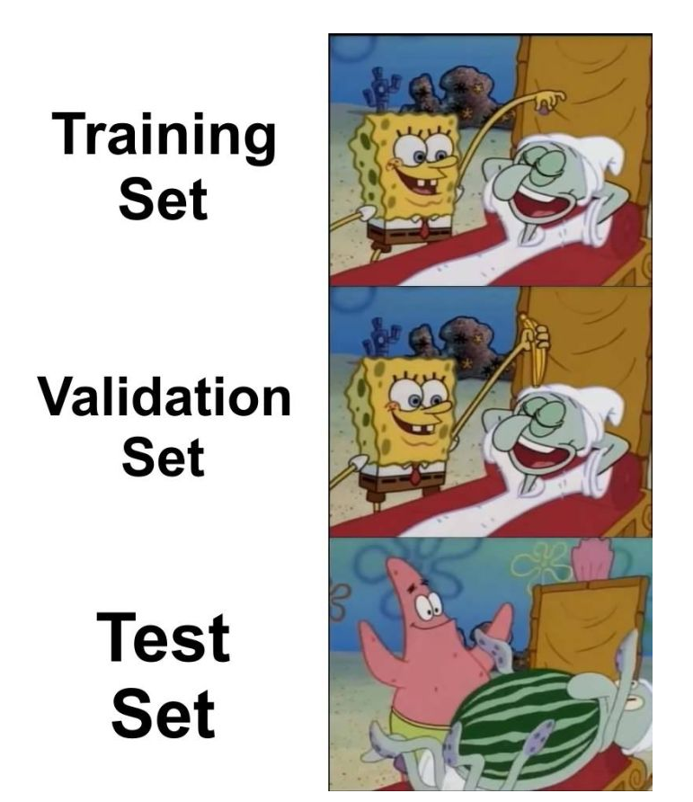
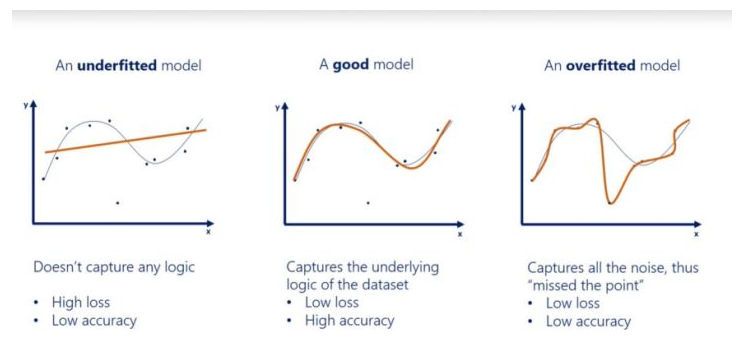
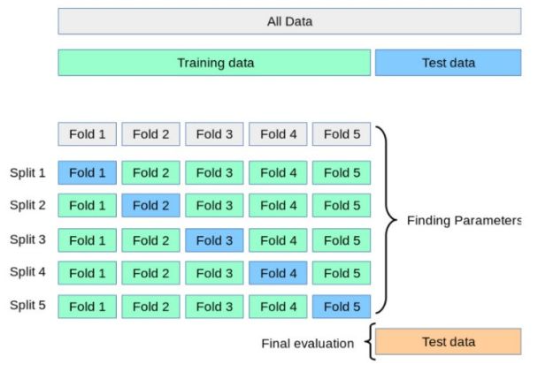
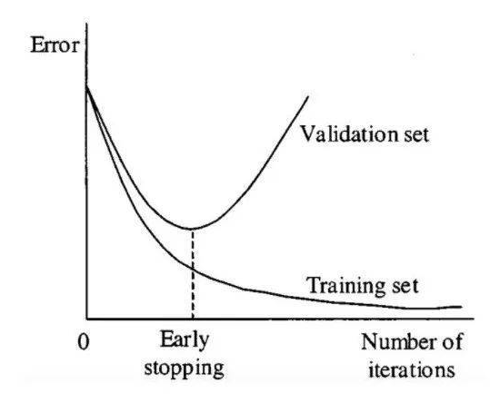
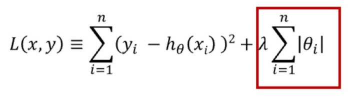
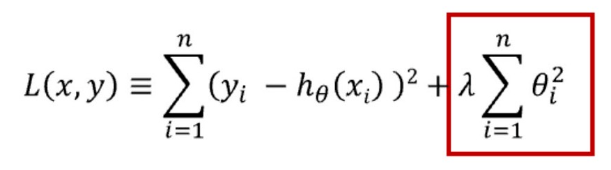
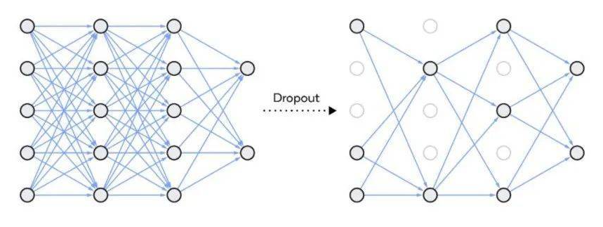

在机器学习中，过拟合（overfitting）会使模型的预测性能变差，通常发生在模型过于复杂的情况下，如参数过多等。本文对过拟合及其解决方法进行了归纳阐述。

在机器学习中，如果模型过于专注于特定的训练数据而错过了要点，那么该模型就被认为是过拟合。该模型提供的答案和正确答案相距甚远，即准确率降低。这类模型将无关数据中的噪声视为信号，对准确率造成负面影响。即使模型经过很好地训练使损失很小，也无济于事，它在新数据上的性能仍然很差。欠拟合是指模型未捕获数据的逻辑。因此，欠拟合模型具备较低的准确率和较高的损失。

**如何确定模型是否过拟合？**

构建模型时，数据会被分为 3 类：训练集、验证集和测试集。训练数据用来训练模型；验证集用于在每一步测试构建的模型；测试集用于最后评估模型。通常数据以 80:10:10 或 70:20:10 的比率分配。

在构建模型的过程中，在每个 epoch 中使用验证数据测试当前已构建的模型，得到模型的损失和准确率，以及每个 epoch 的验证损失和验证准确率。模型构建完成后，使用测试数据对模型进行测试并得到准确率。如果准确率和验证准确率存在较大的差异，则说明该模型是过拟合的。

如果验证集和测试集的损失都很高，那么就说明该模型是欠拟合的。

**如何防止过拟合**

**交叉验证**

交叉验证是防止过拟合的好方法。在交叉验证中，我们生成多个训练测试划分（splits）并调整模型。K-折验证是一种标准的交叉验证方法，即将数据分成 k 个子集，用其中一个子集进行验证，其他子集用于训练算法。

交叉验证允许调整超参数，性能是所有值的平均值。该方法计算成本较高，但不会浪费太多数据。交叉验证过程参见下图：

**用更多数据进行训练**

用更多相关数据训练模型有助于更好地识别信号，避免将噪声作为信号。数据增强是增加训练数据的一种方式，可以通过翻转（flipping）、平移（translation）、旋转（rotation）、缩放（scaling）、更改亮度（changing brightness）等方法来实现。

**移除特征**

移除特征能够降低模型的复杂性，并且在一定程度上避免噪声，使模型更高效。为了降低复杂度，我们可以移除层或减少神经元数量，使网络变小。

**早停**

对模型进行迭代训练时，我们可以度量每次迭代的性能。当验证损失开始增加时，我们应该停止训练模型，这样就能阻止过拟合。

下图展示了停止训练模型的时机：

**正则化**

正则化可用于降低模型的复杂性。这是通过惩罚损失函数完成的，可通过 L1 和 L2 两种方式完成，数学方程式如下：

L1 惩罚的目的是优化权重绝对值的总和。它生成一个简单且可解释的模型，且对于异常值是鲁棒的。

L2 惩罚权重值的平方和。该模型能够学习复杂的数据模式，但对于异常值不具备鲁棒性。

这两种正则化方法都有助于解决过拟合问题，读者可以根据需要选择使用。

**Dropout**

Dropout 是一种正则化方法，用于随机禁用神经网络单元。它可以在任何隐藏层或输入层上实现，但不能在输出层上实现。该方法可以免除对其他神经元的依赖，进而使网络学习独立的相关性。该方法能够降低网络的密度，如下图所示：

**总结**

过拟合是一个需要解决的问题，因为它会让我们无法有效地使用现有数据。有时我们也可以在构建模型之前，预估到会出现过拟合的情况。通过查看数据、收集数据的方式、采样方式，错误的假设，错误表征能够发现过拟合的预兆。为避免这种情况，请在建模之前先检查数据。但有时在预处理过程中无法检测到过拟合，而是在构建模型后才能检测出来。我们可以使用上述方法解决过拟合问题。