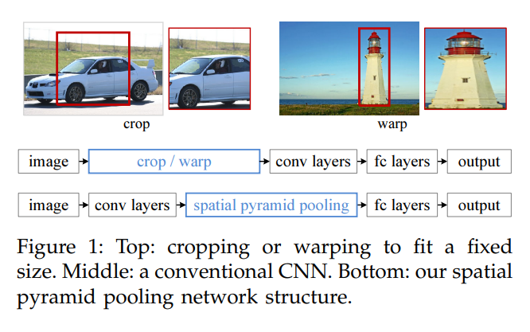

### 前言

FAST-RCNN是于2015年提出的，是RCNN的改进版，它使用了Region of Interest Pooling也就是兴趣区域池化ROI Pooling来共享计算量较大的部分，提高模型的效率。

### FAST-RCNN流程

- 输入图像；
- 利用选择性搜索，提取2000个左右的建议候选区域；
- 然后FAST-RCNN与RCNN不同的是，这里是直接将整张图片输入到CNN中，再进行特征提取；
- 再通过ROI Pooling将每个建议的候选区域固定成相同的尺寸，然后再把RPN映射到最后一层的卷积层中；
- 最后使用Softmax loss进行类别分类和使用Smooth L1 Loss进行边框回归。

### FAST-RCNN与RCNN的对比

#### 测试时速度加快

RCNN是把一张图像分成好多个建议框，然后每个建议框都会被拉伸，之后再送入到CNN中提取特征，但是实际上这些建议框之间会发生大量的重叠，所以重叠的特征之间就没有进行共享。

而FAST-RCNN将整张图像归一化后直接送入CNN，并在最后一层卷积层中加入建议框的信息，于是就将这些特征值进行共享了，减少了运算资源的浪费。

#### 训练速度加快

在RCNN训练时，会先把通过CNN提取的特征存储在硬盘上，然后再使用SVM分类。这样会导致训练性能低下，因为在硬盘上的大量读写操作会降低训练速度。

而在FAST-RCNN训练时，只需要将一张图像输入到网络中，每张图像都是一次性地提取CNN特征和建议框区域，这样训练数据就直接在GPU内存上而不是硬盘上。

#### 减少训练所需的空间

在RCNN中，独立的SVM分类器和回归器都需要在硬盘上存储大量的特征作为训练数据，FAST-RCNN在训练的过程中，不需要额外存储。

#### 使用了多任务损失函数

损失函数使用了多任务损失函数，类别分类使用Softmax Loss和边框回归使用Smooth L1 Loss。将边框回归直接加入到CNN中进行联合训练，这样就可以更新之前卷积层中的参数，实现训练的One Stage，而不是像RCNN一样分阶段单独训练分类器、回归模型。

#### 增加了ROI Pooling

之前提到，RCNN很慢，可是为什么那么慢呢？

因为在仔细看下R-CNN框架发现，对图像提取出建议的候选区域后，需要将每个建议的候选区域当成一张图像进行CNN特征提取特征以及SVM分类，也就是说，对一张图像进行了2000次的这个过程！

但是完全可以对图像提一次特征，然后将这个区域在原图的位置映射到卷积层特征图上，因为这些区域都是图像中的一部分。可是每个建议的候选区域大小是不一样的，不能直接输入进全连接层中，因为全连接层输入必须是固定的长度。

而ROI Pooling就可以解决这个问题当输入一张图片后，会将感兴趣的区域ROI映射到相应的位置。映射关系会根据图像的大小来确定，并且将ROI Pooling输出的坐标映射到上一步的特征区域中，同时会生成多个边界作于后面的池化。

之后我们将不同大小的边框固定成同样大小的特征区域。这样里输出的特征它的大小就不取决于ROI和特征层输入的大小，而是取决于该层设置的pooled_h与pooled_w。

### ROI Pooling 

我们知道，在RCNN中每个候选框需要裁剪crop或者拉伸wrap到固定尺寸227×227，这是因为普通输入到全连接层时，需要是固定的尺寸。可是裁剪的区域可能不包含整个对象，而拉伸的结果可能会导致失真，进而影响识别精度。

ROI Pooling就是实现从原图区域映射到特征图区域再Pooling到固定大小的功能，它最大的好处就是不管给定特征层输入的大小，都可以使得输出的数据维度统一，可以极大提高了处理速度。

ROI Pooling实际上是SPPNet的一个精简版，在SPPNet中，对每个候选区域使用了不同大小的金字塔映射，而ROI Pooling 需要进行一个7x7的下采样。对于VGG16的conv5层来说，有512个特征图，这样经过ROI之后的特征图都是7x7x512维度的特征向量，作为后面全连接层的输入。

由于 ROI Pooling 采用的是最近邻插值INTER_NEAREST ，在resize时，对于缩放后坐标不能刚好为整数的情况，采用了粗暴的舍去小数，相当于选取离目标点最近的点，损失一定的空间精度。

但候选区域l的xywh通常是小数，为了方便操作会把它整数化，将整数化后的边界区域平均分割成 k x k 个单元，对每一个单元边界再进行整数化。经过上述两次整数化，此时的候选框已经和最开始回归出来的位置有一定的偏差，这个偏差会影响检测或者分割的准确度。

所以，总体来说，ROI Pooling l的作用主要有两个：一是将图像中的ROI区域定位到特征图中所对应的位置；二是用一个单层的SPP进行下采样，变成大小固定的特征再传入后面的全连接层。

### 模型的细节

#### VGG16

FAST-RCNN使用了VGG16的中间输出，这里用的是conv5输出，去掉了最后的池化层以及全连接层，并用ROI池化代替了最后的池化层以及使用两个分别用于分类与回归的并列层代替原来的全连接层。

#### Smooth L1 Loss

L1 Loss也称为平均绝对值误差（MAE），是指模型预测值f(x)和真实值y之间绝对差值的平均值。MAE函数虽然连续，但是在0处不可导。而且MAE的导数为常数，所以在较小的损失值时，得到的梯度也相对较大，可能造成模型的震荡。这样就不利于收敛。

L2 Loss也称为均方误差（MSE），是指模型预测值f(x)和真实值y之间差值平方的平均值。L2损失函数的导数是动态变化的，所以x增加也会使损失增加，尤其在训练早起标签和预测的差异大，会导致梯度较大，训练不稳定。

Smooth L1 Loss 结合了 L1 Loss 和 L2 Loss 的优点：早期使用 L1，梯度稳定，快速收敛，后期使用 L2，逐渐收敛到最优解。

Smooth L1损失函数在x较大时，梯度为常数，解决了L2损失中梯度较大破坏训练参数的问题；当x较小时，梯度会动态减小解决了L1损失中难以收敛的问题。所以在目标检测的预测框回归上早期可以考虑Smooth L1 Loss。

#### 尺度不变性

作者不仅提出了使用单一尺度进行训练，还提出了使用图像金字塔实现多尺度训练。

单一尺度直接在训练和测试阶段将图片resize成固定大小，然后直接输入到网络中，希望网络可以自己在训练时能够学习到尺度不变性。

而多尺度则是在训练时随机从图像金字塔中进行缩放图片，采样得到多尺度图片。通过一个图像金字塔向网络提供一个近似的尺度不变，在测试阶段图像金字塔用来对每个目标建议的近似尺度进行归一化，训练阶段每次采样一个图像就随机采样一个金字塔尺度。

虽然多尺度训练比单一尺度训练效果好，但是实际相差不大，然而时间却要慢不少，所以作者最终还是使用单一尺度进行训练。作者还通过这个实验发现：神经网络善于学习尺度的不变性，即对物体的大小不敏感。

#### SVD分解

因为在FAST-RCNN中，要处理选择出来的ROI很多，几乎有一半的前向计算时间被用于全连接层，因此在Fast R-CNN中可以采用SVD分解全连接层，加速推理时的计算。

### 文末

虽然FAST-RCNN提出了ROI Pooling ，但是一开始选择搜索的过程仍然不是很高效。不过技术的进步总是一步一个脚印，相比于RCNN，FAST-RCNN还是进步了许多，单从速度来看，就比RCNN快213倍，并且精度还达到了当时的SOTA！

### 参考链接

https://arxiv.org/pdf/1504.08083.pdf

https://arxiv.org/pdf/1406.4729.pdf

