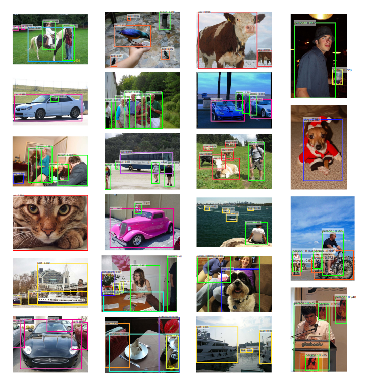
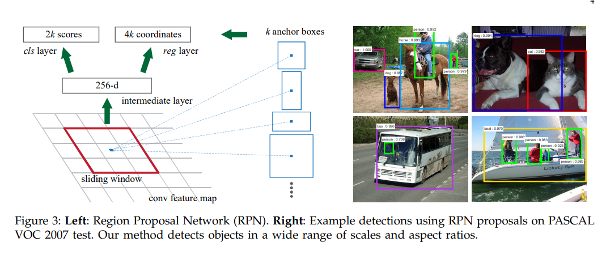
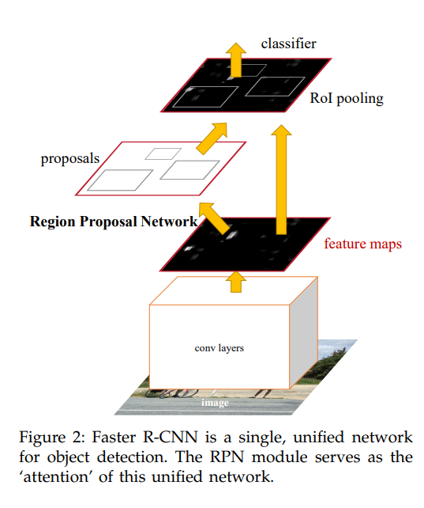
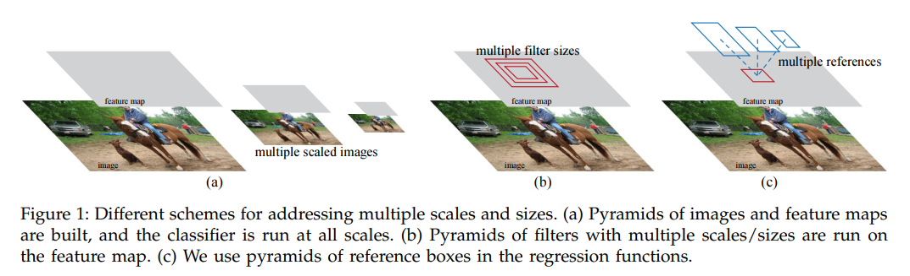
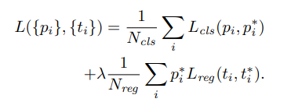
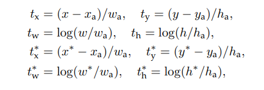
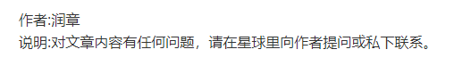

### 前言

在Fast-RCNN发表没多久，Faster-RCNN也随即诞生，这也是RCNN系列的第三篇代表作。

### 算法原理

Faster-RCNN对输入的整张图像进CNN中来作特征处理，然后生成大约300个建议窗口，之后对这些建议窗口映射到最后一层卷积中，再通过ROI Pooling生成固定大小的特征区域，最后利用Softmax Loss和Smooth L1 Loss对类别分类概率和边框回归进行联合训练。

和Fast-RCNN不同的是，这里使用了RPN代替了选择性搜索，数量上也从2000减少到300，并且产生建议窗口的CNN和目标检测的CNN共享在Faster-RCNN中，我们使用9个anchor送进去RPN中，之后输出了9个anchor中前两个概率最大的概率值和四个坐标。每个anchor经过回归后对应到原图，然后再对应到特征图上，经过ROI Pooling后输出7x7大小的特征层，最后对这个7x7的特征进行分类和再次回归。

### 工作流程

(1)输入图片；

(2)将整张图片输入到CNN中进行特征提取；

(3)用RPN生成建议窗口proposals，生成大约300个建议窗口；

(4)之后就把这些建议窗口映射到前面CNN的最后一层卷积层中；

(5)通过ROI Pooling生成固定大小的特征区域；

(6)利用Softmax Loss 和Smooth L1 Loss进行类别分类和边框回归的联合训练；

### 相比于FAST RCNN的改进点

(1)使用RPN网络代替原来的选择性搜索方法来生成建议窗口，建议窗口的数量也从2000减少至300，除了数量改善之外，建议窗口的质量也有所提升。

(2)用于产生的建议窗口的CN进行分类、回归时，是共享CNN网络的；在Faster-RCNN中，RPN网络会对特征图进行窗口滑动，每个滑动窗口的中心作为anchor的中心，这里会采用九种尺寸大小的anchor进行映射，映射回原图区域，然后使用这九种anchor送到RPN中，最后输出九种anchor中，分数居于前二的概率值和四个坐标会保留下来。

### RPN训练时的设置

(1)在训练RPN时，从一张图像中任意选取的256个目标区域组成，其中正负样本的比例为1:1。

(2)如果正样本数量不足128，那么就会挖掘多一些负样本，凑齐256个，反之亦然。

(3)训练RPN时，因为它和VGG的结构是一样的，所以可以加载ImageNet的预训练模型，然后剩余层的参数就采用标准差=0.01的高斯分布进行初始化。

### anchor的使用

对于每个anchor，会被分配成前景标签或者背景标签，或者不进行分配。其中只有被分配标签的anchor才会进行训练，那些不进行分配所被忽略掉的则不会进入训练。

对于每个gt box，会找到与之IOU最大的anchor，然后将这个anchor设为正样本。对于每个anchor，只要找到和它IOU大于0.7的gt box就会被认为是正样本。

对于每个anchor只要它与任意一个gt box的IOU都要小于0.3的话，就会被当做负样本，最后那些不是正样本也不是负样本的anchor会被忽略。

每个anchor经过回归后会对应回原图，然后再对应到特征层。之后会输入到ROI部分，经过ROI Pooling后输出7x7大小的特征，最后对这些特征进行类别分类和边框回归。

训练RPN时，是通过1:3比例的正负样本进行训练。在这里，会对RPN的anchor进行NMS。

首先利用四个回归之后的坐标对九个wxhx的anchor进行坐标变换来生成目标区域，然后根据置信度对这些目标区域进行排序。在训练时选择前12000个，而测试时选择前6000个，再对剩下的目标区域进行NMS处理，这里设定的NMS阈值是0.7，之后还会进行再次筛选，训练时只留下2000个，测试时留下300个。这些最终留下的proposal就是ROI了。

### 训练时的损失函数

Faster-RCNN使用了分步训练的方法，即每个模块分别训练再合并训练的权重。

Faster-RCNN采用了四个loss，其中两个用于RPN，两个用于RCNN，分别用于类别分类与边框回归。

对于RPN来说，分类采用的是交叉熵进行二分类，区分前景与背景；回归采用的是Smooth L1 Loss。相对于L1、L2 Loss来说，Smooth L1 Loss更具鲁棒性，因为它兼具了前面两者的优点。

对于经过ROI Pooling的RCNN部分来说，分类采用的是交叉熵进行多分类，这里会将背景这个类别也加上去；回归采用的仍然是Smooth L1 Loss。

### 参考链接

https://arxiv.org/pdf/1506.01497.pdf

### 文末

相比于RCNN，Faster-RCNN已经进步了许多，可以应用于多种任务。除了目标检测之外，还有语义分割、3D目标检测任务都可以基于Faster-RCNN，可以说，Faster-RCNN也成为了一个基石。

