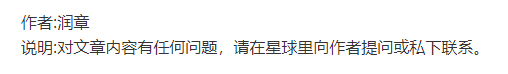

### 前言

RCNN可以算是目标检测的鼻祖了，它也是Two-Stage目标检测算法的开山之作。我们知道，目标检测算法是分为One-Stage流派和Two-Stage流派，而RCNN系列就是典型的Two Stage。这里简单阐述一下One-Stage、Two-Stage。

- One-Stage检测算法：
  - 没有通过选择搜索产生候选区域的阶段，直接产生物体的类别概率和位置坐标，经过单次检测可以直接获得最终的检测结果。相比Two-Stage有更快的速度。
  - 代表网络有YOLO系列，SSD，RetinaNet。
- Two-Stage检测算法：
  - 将检测问题划分成两个阶段，首先是获取候选区域进行位置精修和分类阶段。相比于One-Stage,精度高，漏检率也低，因为在第二阶段会对目标做resize, 小目标的特征也会被放大，因此其特征轮廓也更为清晰，那么检测结果就更加准确。
  - 代表网络有RCNN、Fast RCNN，Faster RCNN。
- Two-Stage和One-Stage的差异
  - Two-Stage先对前景背景做了筛选，再进行回归，回归效果比较好，准度高但是相比较慢。
  - One-Stage是直接对特征上的点进行直接回归，优点是速度快，缺点是因为正负样本失衡导致检测较差，要结合难例挖掘。但是如果所有的anchor都没有覆盖到这个目标，那么这个目标就会漏检。

| 优缺点 | Two-Stage                  | One-Stage                              |
| ------ | -------------------------- | -------------------------------------- |
| 优点   | 精度高、对小物体检测效果好 | 速度快、学到的特征泛化性强             |
| 缺点   | 速度慢、训练、推理的时间长 | 精度低，容易漏检、小物体的检测效果不好 |

### RCNN简介

我们知道，传统的目标检测是对每个滑动窗口进行检测，RCNN作者就抛弃了这种做法，他认为，这样频繁检测是一种资源浪费的行为。与传统目标检测算法不同，RCNN它的流程为：

- 首先输入图像；
- 利用选择搜索在图像中提取了2000个左右的RPN；
- 在区域建议网络RPN上缩放到227x227大小，再输入到卷积神经网络中；
- 然后再提取其中的特征给到SVM进行分类；
- SVM分类完成后就使用一个线性回归器做边框回归，用边框回归值来校正原来的建议框，最终生成预测窗口坐标。

### 选择搜索

传统的目标检测中的滑动窗口会产生许多冗余候选框，并且这些冗余候选框大多都是重叠的。根据这点，选择搜索则是自底向上合并相邻的重叠区域，从而减少冗余。

选择搜索是基于图像分割的技术，它的步骤为：

1. 假设图片上有n个预分割的区域分别为{R1, R2, ..., Rn}；
2. 计算每个区域和它相邻的区域的相似度，这样会得到一个nxn的相似度矩阵，同一个区域之间和一个区域与不相邻区域之间的相似度可设为NaN，然后从矩阵中找出最大相似度值对应的两个区域，并将这两个区域合并，这时候图上就还剩下n-1个区域；
3. 重复以上过程，注意只需要计算新的区，与它相邻区域的新相似度,其他的不用重复计算。每重复一次，区域的总数就会减一，直到最后所有的区域都合并成了同一个区域。在过程中，一共进行了n-1次，最后区域的数量变成了1。

### CNN与SVM

在RCNN中使用了VGG16来进行特征提取，并将特征向量输入到SVM中进行分类。在微调模型的时候，使用了mageNet的预训练模型，并将最后一层全连接层去掉，替换成classes+1个类别的输出，这里的1是指背景。

其实我们知道，本来就可以直接使用CNN做分类，为什么还要用SVM呢？

这是因为它们所定义的正负样本形式不同。在CNN训练时，即使每个框只包含物体的一部分，但是仍然会将它标注为正样本，当IOU大于0.5就被认作正样本。因为对于少量样本来说，CNN容易发生过拟合，所以需要大量的训练数据。

然而SVM训练时，因为SVM适合少样本训练，所以对于训练数据的IOU就比较严格，我们只有当框把整个物体都包含进去了，才认为它是正样本。

### RCNN缺点

(1) 训练分为多个阶段，分别为：微调网络+训练SVM+训练边框回归器；

(2) 训练耗时，以及占用磁盘空间大；

(3) 测试速度慢：对于图片的每个候选区域都需要进行CNN前向推理；

(4) 在SVM和边框回归过程中CNN的特征并没有进行更新；

### 文末

虽然RCNN已经是历史久远的技术了，但是我们还是可以从它身上了解到目标检测的发展历程，以及通过其中的步骤，对整个目标检测的流程有个更深入的了解。

### 参考链接

https://arxiv.org/pdf/1311.2524v5.pdf

https://ivi.fnwi.uva.nl/isis/publications/2013/UijlingsIJCV2013/UijlingsIJCV2013.pdf

