## **前言** 

本文介绍了目标检测中 one stage 的 YOLO 算法，并介绍了从 YOLOv1 到 YOLOv3 的发展过程。

## **YOLO的设计理论**

YOLO 全称叫 You Only Look Once。是目标检测中 one stage 的典型之作。此外，目标检测的流派还有 two-stage，如 RCNN 系列；以及anchor free，如 cornnet、centernet。

其实 YOLO 就是通过一系列的卷积操作来实现端到端的目标检测。YOLO 会将图片划分为 S x S 的网格(grid)，每个网格负责检测落入其中的目标，最后输出所含目标的边框(bounding box)、定位的位置信息、以及所有类别的置信度。

基本流程如下：

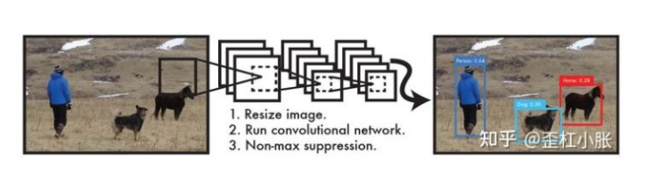

1. 首先将输入图片 resize 到固定大小。

2. 输入到网络中，最后得到预测结果检测到的目标。

3. 使用非极大抑制算法来过滤冗余目标。

## **非极大值抑制算法(nms)**

不仅仅是YOLO才会使用到nms，其实在大多数目标检测算法都会使用nms。它主要是为了解决一个目标被重复检测的现象。如下图，我们可以看到人脸被重复检测了。虽然每个框都检测对了，但我们只需要得到一个框，即最好的那一个框。

那么采用NMS就可以实现这样的效果。首先从所有的检测框中找到置信度最大的那个，然后遍历剩余的框，计算其与最大框之间的IOU。如果其值大于一定阈值，则表示重合度过高，那么就将该框就会被剔除；然后对剩余的检测框重复上述过程，直到处理完所有的检测框。

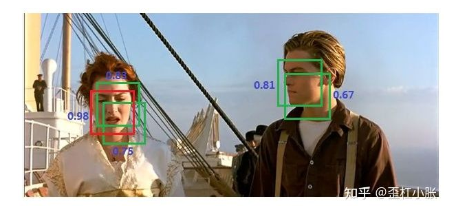

## **YOLOv1**

其实 YOLOv1 和后续的 YOLO 算法最大的不同是 YOLOv1 并没有使用锚点框(anchor box)，在 YOLOv1 中是没有 anchor 这个概念的，严格上来说 YOLOv1 属于 anchor free。

### **算法思想**

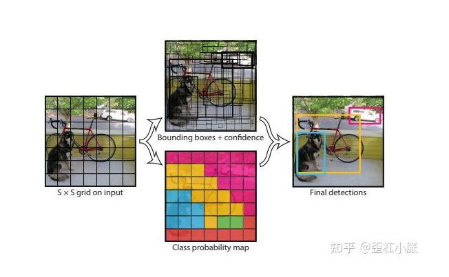

1. 将图像划分为 S x S 的网格，论文中的设置是 7 x 7 的网格。如果某个物体的中心落在这个网格中，那么这个网格就负责预测这个物体。

2. 然后每个网格预测 B 个边框，论文中的设置是2个边框，即预测出 7 x 7 x 2 个边框，这个边框负责预测物体的位置。

3. 每个边框除了要预测物体的位置之外，还要附带预测一个置信度。这里的置信度指的是边框的概率，无关目标属于哪一个类别，表示的是边框内是否有物体。

4. 每个网格还要预测C个类别的分数。比如说在 VOC 数据集上则会预测出20个类别。

5. 因此，对于 VOC 数据集来说，YOLOv1 的网络最后是输出预测位置（xywh）+置信度以及类别分数，所以输出为 7 x 7 x (5 + 5 + 20)。

6. 最后一层全连接层用线性激活函数，其余层采用 Leaky ReLU。

   

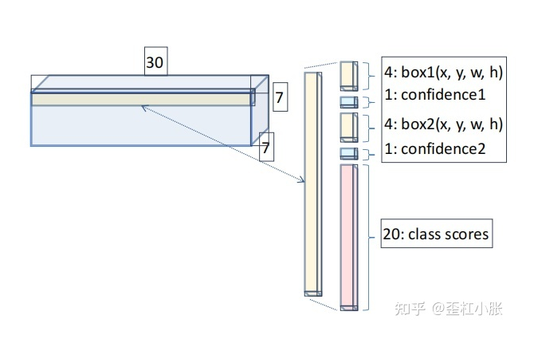

### **损失函数**

可以看到损失函数有三个部分组成，分别是边框损失，置信度损失，以及类别损失。并且三个损失函数都使用均方差损失函数(MSE)。

### **有趣的说法**

有一个有趣的说法：YOLO将检测问题当做回归任务来解决，而不是分类任务。大家可以想下是为什么？

### **不足之处**

1. 因为每个网格单元只预测两个框，并且只有一个类别。即每个网格只会选择出 IOU 最高的那个目标，所以如果每个网格包含多个物体，就只能检测出其中一个，所以对于拥有群体小目标的图片来说，比如鸟群，检测效果会很差。也可能是因为这种方式导致减少了对同一目标的多次检测，最终识别物体位置精准性差，召回率低。

2. 当出现新尺寸的目标时，效果也会变差，原因是 YOLOv1 使用简单的特征来预测边界框，并没有使用 anchor，导致定位的不准确。

3. 最后的输出层为全连接层。因为全连接层输出大小是固定的，所以导致图像的输入大小也必须固定，这在一定程度上来说有局限性。

4. MSE 在处理大边框和小边框时，赋予的权重是一样的。假设同样是预测与实际相差25个像素点，但是对于大边界框来说，小错误通常是无足轻重的，甚至可以忽略不计，但对于小边界框来说，这个数值对于它的影响就很大了。

## **YOLOv2**

YOLOv2 也叫 YOLO9000，因为使用了 COCO 数据集以及 Imagenet 数据集来联合训练，最终可以检测9000个类别。

### **算法思想**

1. 使用 Darknet19 作为网络的主干网络。Darknet19 有点类似 VGG，在 Darknet19 中，使用的是 3 x 3 大小的卷积核，并且在每次Pooling 之后都增加一倍通道数，以及将特征图的宽高缩减为原来的一半。网络中有19个卷积层，所以叫 Darknet19，以及有5个 Max Pooling 层，所以这里进行了32倍的下采样。

   

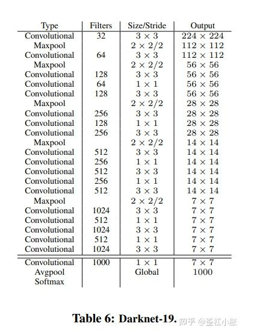

2. 采用了 Batch Normal 层来加速训练时的收敛速度，并且使用了 Batch Normal 就可以从去掉 Dropout，而不会产生过拟合。在 Batch Normal 的论文中讲道， Batch Normal 作用和 Dropout 的作用是类似的。

3. 使用了先验框 anchor，基于 Kmeans 的聚类方法来根据数据集的标签来自动提取先验框的信息，所以可根据不同的数据集设置 anchor 。当 Cluster IOU 选择值为5时，Avg IOU比不用聚类的方法要高一些。选择值为9的时候，Avg IOU有更加明显地提升。

   

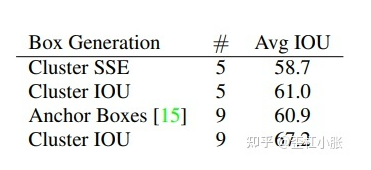

4. 使用了更高的分辨率，训练时从 224 x 224 提升到了 448 x 448。并且采用了随机裁剪、旋转、颜色变换、饱和度变换， 曝光度变换等数据增强的操作。

5. 可以进行多尺度训练，每迭代10个 batch，随机更换尺寸320、352...608，注意这里都为32的倍数，因为在 Darknet19 中进行了32倍的下采样操作。

6. 使用了 Pass through，类似 Pixel-shuffle，融合高层和低层的信息，这样可以保留一些细节信息，这样可以更好检测小物体。具体来说，就是进行一拆四的操作，直接传递到池化后的特征图中，进行卷积后再叠加两者，最后一起作为输出特征图进行输出。通过使用 Pass through 层来检测细粒度特征使 mAP 提升了1个点。

   

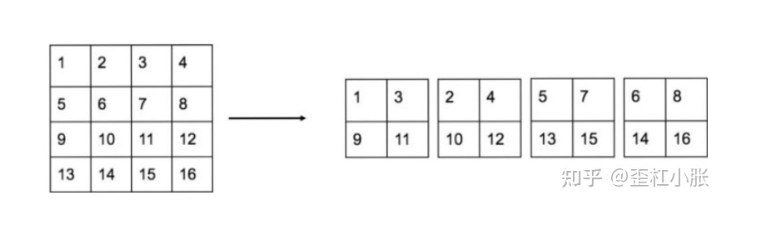

7. 网络去掉了最后一个卷积层，而加上了三个 3 x 3 卷积层，分别预测大尺度、中尺度、小尺度的物体。其中每个卷积层有1024个卷积核，并且每个卷积层紧接着一个 1 x 1 卷积层。每个 anchor 预测5个边界框，所以对于 VOC 数据集来说，每个边界框会输出5个坐标的相关信息和20个类别的相关信息。

### **位置的预测**

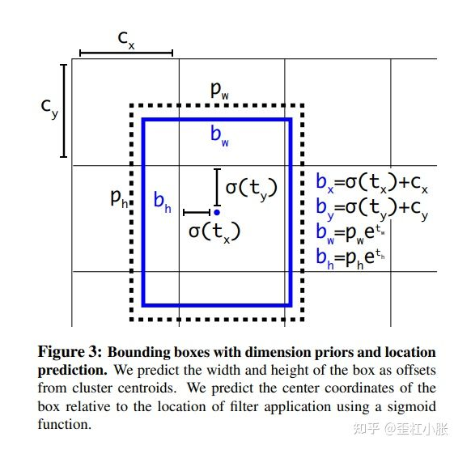

在 YOLOv2 中的位置预测中，加入了 sigmoid 的约束是因为没有约束的话，预测的边界框容易向任何方向偏移任意大小，可能出现这个 anchor 的中心点落在了其他的 anchor 的区域上。这就导致每个位置预测的边界框可以落在图片的任意位置，容易导致模型训练的不稳定性，在训练的时候要花很长时间才可以得到正确的偏移。

在 YOLOv2 中，就是预测边界框中心点是相对于对应网格的左上角位置进行相对偏移，为了将边界框中心点约束在当前网格中，使用 sigmoid 函数处理偏移值，这样预测的偏移值在(0,1)范围内。这里将每个网格的尺度看做是1的基本单位。

## **YOLOv3**

啥也不多说，光看这张图，就可以感受到 YOLOv3 的强大。仿佛在说：我不是针对谁，我是说，在座的各位都是xx~

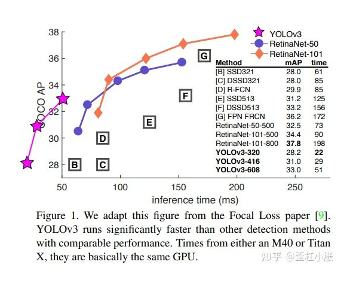

YOLOv3 采用了作者自己设计的 Darknet-53 作为主干网络，Darknet-53 借鉴了残差网络的思想，与 Resnet101、Resnet152 相比，在精度上差不多的同时，有着更快的速度。

在下采样操作中使用了步长为2的卷积来代替传统的池化操作；在特征融合方面，为了提高小目标的检测性能，引入了类似 FPN 的多尺度特征融合方法，特征图在经过上采样后与前面层的输出进行 concat 操作，这样可以融合浅层特征和深层特征，使得 YOLOv3 在小目标的精度上有了很大的提升。并且使用逻辑回归替代 softmax 作为分类器，为的就是解决多标签分类问题，比如一个物体既属于A类，又属于B类。

### **算法思想**

1. YOLOv3 的输出依旧分为三个部分，首先是置信度、然后是坐标信息，最后是分类信息。在推理的时候，特征图会等分成 S x S 的网格，通过设置置信度阈值对网格进行筛选，如果某个格子上存在目标，那么这个格子就负责预测该物体的置信度、坐标和类别信息。

2. 使用了残差模型的思想：Darknet-53。这个是类似 Resnet 的结构，不断堆叠残差结构，并且没有最大池化层。既然没有池化来进行下采样，那么下采样的操作就通过两个步长的卷积操作完成。所以整体来看，网络全部由卷积搭建而成，也就是全卷积网络。基本部件DBL：Conv + BN + Leaky ReLU、残差结构 res_unit。

   

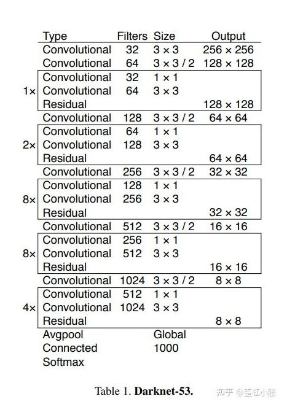

3. 多尺度预测，采用类似 FPN 融合的方式，在三个不同尺寸大小的特征层上预测不同尺度信息，每个特征层三种尺度，所以最后为9个，从 YOLOv2 的5个变成9个。

4. 大目标输出维度：13 x 13 x 255，其中255 = ( 80 + 5 ) × 3；中目标输出维度：26 × 26 × 255；小目标输出维度：52 × 52 × 255。这里的80个类别是因为使用了COCO 数据集。

5. 采用了新的正负样本匹配策略：如果重合度高但不是最高的，则依旧抛弃。只选取重合度最高的。

6. 分类器损失采用二分类交叉损失熵 binary cross-entropy loss(BCE)，而不是使用 softmax，因为有的目标可能存在重叠的类别标签，也就是多标签分类。如 SUV 又是车又是 SUV，而 softmax 只会输出最大的那一个类别。

### **损失函数**

损失函数：置信度损失使用的是 BCE、类别损失也是使用 BCE、定位损失使用均方差损失函数(MSE)。只有正样本才参与类别损失，定位损失还有置信度损失三者的计算，但是负样本只参与置信度损失。

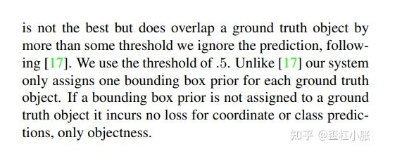

并且三个损失函数之间加入了平衡系数，来平衡损失。

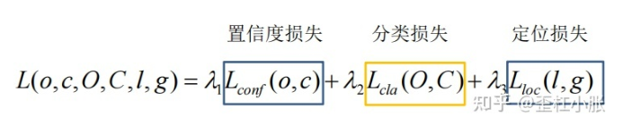

### **YOLOv3 快的原因**

YOLOv3 和 SSD 比网络更加深了，虽然 anchor 比 SSD 少了许多，但是加深的网络深度明显会增加更多的计算量，那么为什么 YOLOv3会比 SSD 快3倍？因为 SSD 的 backbone 使用的是 VGG16，YOLOv3 用的其最新原创的 Darknet，Darknet-53 与 Resnet 的网络结构，Darknet-53 会先用 1 x 1 的卷积核对 feature 进行降维，随后再使用 3 x 3 的卷积核升维。在这个过程中，这样可以大大降低参数的计算量以及模型的大小，有点类似于低秩分解。究其原因还是做了很多优化，比如用卷积替代全连接，1 x 1 卷积减小计算量等。

## **论文链接**

笔者以前都是在博客、公众号上看别人的论文讲解，去消化别人咀嚼过的知识。但后来别人还是建议我多多去读原论文，从最开始的地方去理解，这样才会有自己的独特见解，以及会理解得更加透彻。所以我还是会建议大家多去看看原论文，以下就是原论文的链接：

YOLOv1: https://arxiv.org/abs/1506.02640

YOLOv2: https://arxiv.org/abs/1612.08242

YOLOv3: https://arxiv.org/abs/1804.02767

## 文末

希望大家看完本篇文章后，能对YOLO有个更深的理解。后续我会继续更新YOLOv4的解析，大家敬请期待。