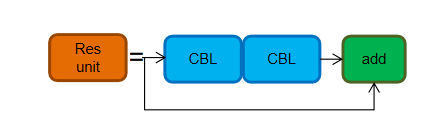
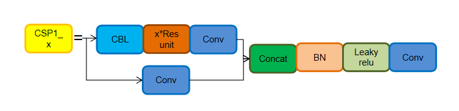
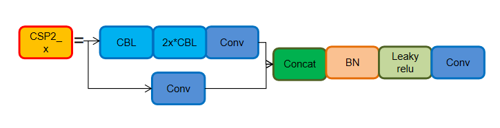
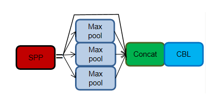
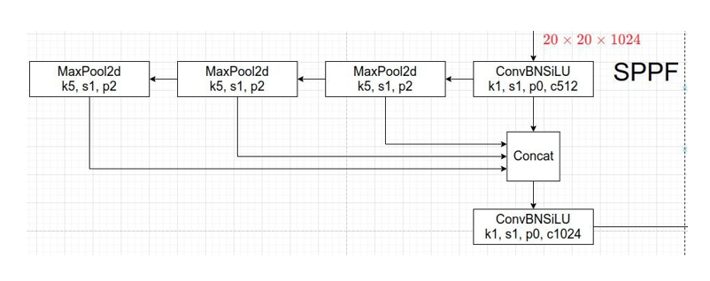
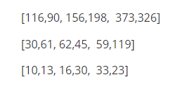
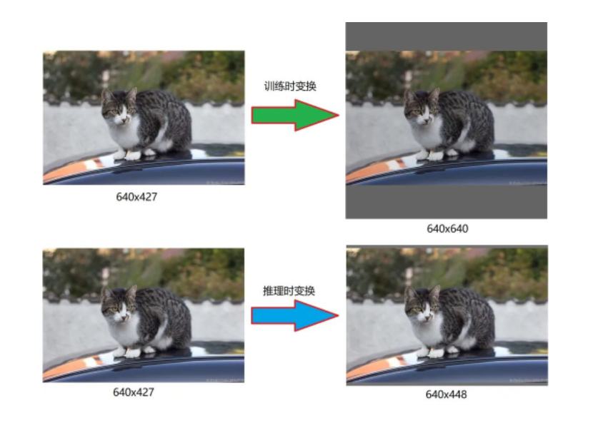
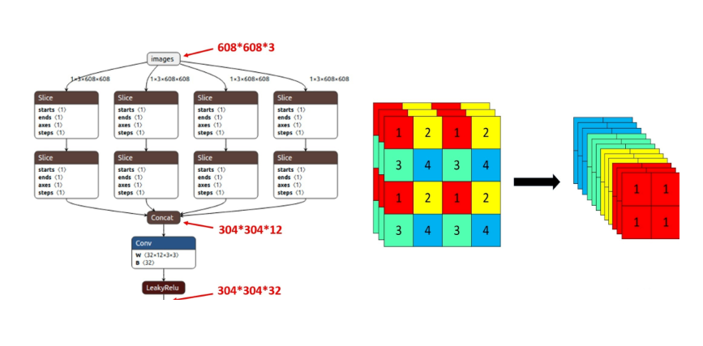
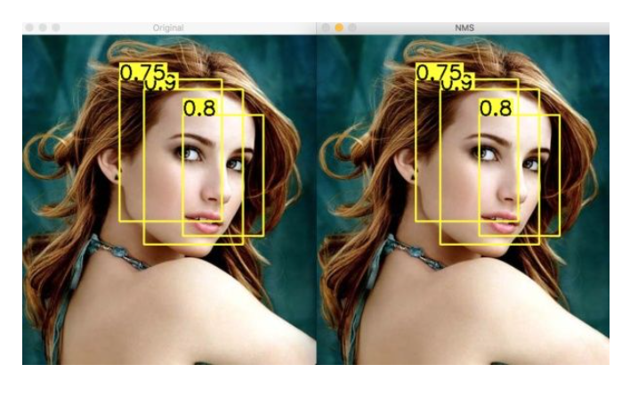
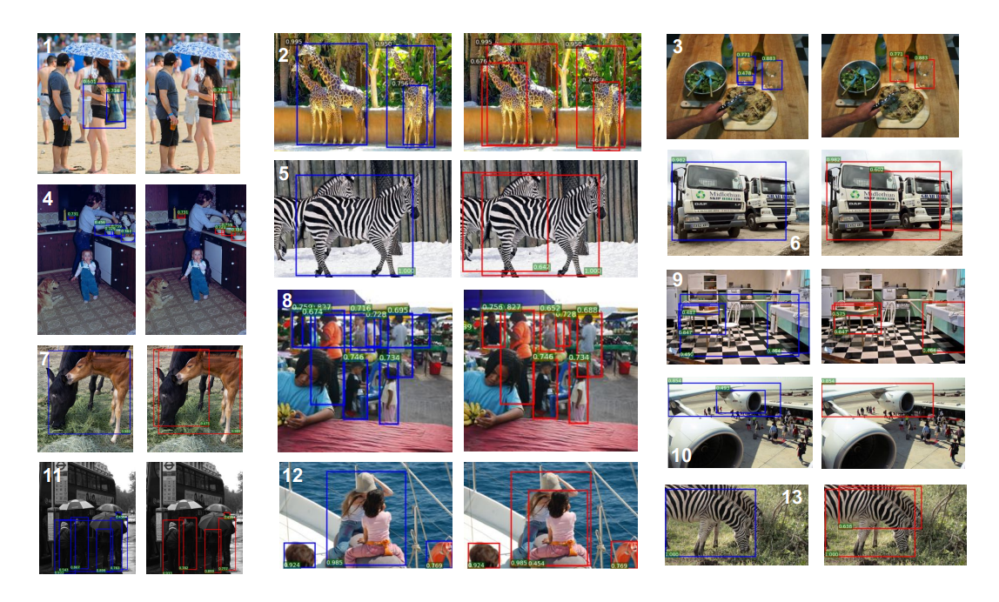

## **前言**

YOLOv5 是在 YOLOv4 出来之后没多久就横空出世了。今天笔者介绍一下 YOLOv5 的相关知识。目前 YOLOv5 发布了新的版本，6.0版本。在这里，YOLOv5 也在5.0基础上集成了更多特性，同时也对模型做了微调，并且优化了模型大小，减少了模型的参数量。那么这样，就更加适合移动端了。

## **YOLOv5 网络模型结构**

与之前的 YOLOv3、YOLOv4 不同，v3、v4 除了有完整的大模型之外，只有一个轻量级的 tiny 模型，值得注意的是，在 tiny 中，只有两个输出层。而 YOLOv5 则具备四种网络模型： YOLOv5s、YOLOv5m、YOLOv5l、YOLOv5x 四种模型。

它们是通过 depth_multiple 和 width_multiple 来控制网络的宽度和深度，这类似 EfficientNet 的思想。

其中，YOLOv5s 在该系列中是深度最小，并且特征图的宽度也最小的网络。其他的网络是在此基础上进行不断地加深、加宽。

### **YOLOv5 基础组件**

- CBL 由 Conv + BN + Leaky_ReLU 组成。

- Res unit 是借鉴残差结构的思想来构建网络的。

  

- CBM 是残差模块中的子模块。Conv + BN + Mish 激活函数 。

- CSP1_X 由 CSPNet 演变而来，该模块由 CBL 模块、Res unit、Conv、还有 Concate 组成，其中X代表有X个这个模块。

  

- CSP2_X 也是由 CSPNet 网络组成，该模块由 Conv 和 X个 Res unit Concate 而成。

  

- SPP 从 YOLOv3 起，就有使用 SPP 模块。SPP 是 通过采用 1 × 1、5 × 5、9 × 9 和 13 × 13 的最大池化方式，来进行多尺度特征的融合。

  

- 新版的 YOLOv5 中使用的是升级版的 SPP结构，SPPF。它是将原本并行的 MaxPool 替换成了串行 MaxPool。其中串行两个 5 x 5 大小的 MaxPool 和一个 9 x 9 大小的 MaxPool 是等价的，而串行三个 5 x 5 大小的 MaxPool 层和一个 13 x 13 大小的 MaxPool 是等价的。并行和串行的效果一样，但串行的效率更高。

  

## **YOLOv5 知识点**

总体来说，YOLOv5 和 YOLOv4 差不多，但还是做了一些调整、优化。在 YOLOv5 中涉及到的知识：**Mosaic数据增强、自适应锚框计算、自适应图片缩放、Focus 结构、CSP 结构、FPN + PAN 结构、GIOU_Loss**。

### **自适应锚框计算**

像之前的 YOLOv3、YOLOv4，对于不同的数据集，都会计算先验框 anchor。然后在网络训练时，网络会在 anchor 的基础上进行预测，然后输出预测框，再和标签框进行对比，最后就进行梯度地反向传播。

在 YOLOv3、YOLOv4 中，训练不同的数据集时，是使用单独的脚本进行初始锚框的计算，在 YOLOv5 中，则是将此功能嵌入到整个训练代码里中。所以在每次训练开始之前，它都会根据不同的数据集来自适应计算 anchor。

如果你觉得计算的锚框效果并不好，那你也可以在代码中将此功能关闭。

**自适应的计算具体过程：**

> 1. 获取数据集中所有目标的宽和高。

> 2. 将每张图片中按照等比例缩放的方式到 resize 指定大小，这里保证宽高中的最大值符合指定大小。

> 3. 将 bboxes 从相对坐标改成绝对坐标，这里乘以的是缩放后的宽高。

> 4. 筛选 bboxes，保留宽高都大于等于两个像素的 bboxes。

> 5. 使用 k-means 聚类三方得到n个 anchors，与v3、v4 操作一样。

> 6. 使用遗传算法随机对 anchors 的宽高进行变异。倘若变异后的效果好，就将变异后的结果赋值给 anchors；如果变异后效果变差就跳过，默认变异1000次。这里是使用 anchor_fitness 方法计算得到的适应度 fitness，然后再进行评估。

### **自适应图片缩放**

自适应图片缩放-针对不同的目标检测算法而言，我们通常需要执行图片缩放操作，即将原始的输入图片缩放到一个固定的尺寸，再将其送入检测网络中。YOLO 系列算法中常用的尺寸包括416 * 416，608 * 608 等尺寸。

原始的缩放方法存在着一些问题，因为在实际的使用中的很多图片的长宽比不同，所以在进行缩放填充之后，两端的黑边大小都不相同，但是如果填充过多，则会存在大量的信息冗余，从而影响整体的推理速度。

为了进一步提升推理速度，YOLOv5 提出一种方法能够自适应的添加最少的黑边到缩放之后的图片中。效果如下图所示：

1. 根据原始图片大小与输入到网络图片大小计算缩放比例。

2. 根据原始图片大小与缩放比例计算缩放后的图片大小。

3. 计算黑边填充数值。

   

需要注意的是：

1. 该操作仅在模型推理阶段执行，模型训练阶段仍然和传统的方法相同，将原始图片裁剪到 416 x 416 大小；
2. YOLOv3 与 YOLOv4 中默认填充的数值是 (0,0,0)，而 YOLOv5 中默认填充的数值是 (114,114,114)；
3. 该操作仅仅针对原始图片的短边而言，仍然将长边裁剪到416。

## **Backbone**

### **Focus结构**

Focus 模块，输入通道扩充了4倍，作用是可以使信息不丢失的情况下提高计算力。Focus 是在 YOLOv5 中提出来的，它先将特征图进行分块切片操作，然后再将结果 Concat 起来，再送入后面模块。

在新版中，YOLOv5 将Focus 模块替换成了一个 6 x 6 的卷积层。两者的计算量是等价的，但是对于一些 GPU 设备，使用 6 x 6 的卷积会更加高效。

在 YOLOv5s 中，608 x 608 x 3 的图片经 Focus 处理，会变成 304 x 304 x 12 的特征图，这样一定程度上提高了特征图的操作。然后会再经过一次32个卷积核变成 304 x 304 x 32 的特征图。在 YOLOv5s 中，Focus 最后使用了大小为32的卷积核，但是其他结构如 YOLO5m 是使用更大数目的卷积核。

### **CSP结构**

YOLOv5 与 YOLOv4 的不同点在于，YOLOv4 只有主干网络使用了 CSP结构， 而在 YOLOv5 中，设计了两种 CSP 结构。其中，CSP1_X 应用于 Backbone，另一种 CSP2_X 则是应用于 Neck 中。

## **Neck**

YOLOv5 对 FPN + PAN 的结构作了一些改动。在这里使用了另外一种 CSP2_X 的结构，加强网络特征融合的能力。

## **HEAD**

在训练阶段，YOLOv5 与 YOLOv4 一样，采用其中的了 CIOU_Loss。在推理阶段，YOLOv4 在 DIOU_Loss 的基础上采用了 DIOU_nms 的方式，而 YOLOv5 是采用加权 nms 的方式。

## **NMS 非极大值抑制（non maximum suppression）**

NMS 的本质是搜索局部极大值，抑制非极大值元素。非极大值抑制，主要就是用来抑制检测时冗余的框。因为在目标检测中，在同一目标的位置上会产生大量的候选框，这些候选框相互之间可能会有重叠，所以我们需要利用非极大值抑制找到最佳的目标边界框，消除冗余的边界框。

**算法的大致流程为：**

1. 对所有预测框的置信度降序排序

2. 选出置信度最高的预测框，确认其为正确预测，并计算他与其他预测框的 IOU

3. 根据步骤2中计算的 IOU 去除重叠度高的，IOU > threshold 阈值就直接删除

4. 剩下的预测框返回第1步，直到没有剩下的为止

   

**NMS 一次处理只会一个类别，所以如果有N个类别，那么就需要执行N次。**

## **SoftNMS**

当两个目标靠的非常近时，置信度低的会被置信度高的框所抑制，那么当两个目标靠的十分近的时候就只会识别出一个 bbox。为了解决这个问题，可以使用 softNMS。它的基本思想是用稍低一点的分数来代替原有的分数，而不是像 nms 一样直接置零。

## **训练策略**

YOLOv5 也使用了许多训练策略。

1. 多尺度训练。如果网络的输入是416 x 416。那么训练的时候就会从 0.5 x 416 到 1.5 x 416 中任意取值，但所取的值都是32的整数倍。
2. 训练开始前会使用 warmup 进行训练。在模型预训练阶段，先使用较小的学习率训练一些epochs或者steps (如4个 epoch 或10000个 step)，再修改为预先设置的学习率进行训练。
3. 使用了 cosine 学习率下降策略。
4. 采用了 EMA 更新权重，相当于训练时给参数赋予一个动量，这样更新起来就会更加平滑。
5. 使用了 amp 进行混合精度训练。能够减少显存的占用并且加快训练速度，但是需要 GPU 支持。

## **损失函数**

YOLOv5 的损失依旧是由 Classes loss、Objectness loss、Location loss组成：

Location loss 采用的是 CIOU loss，这里只会计算正样本的定位损失。

Classes loss 和 Objectness loss 采用的是 BCE loss。其中 Classes loss 也只会计算正样本的分类损失。

Objectness loss 是使用所有样本进行反向传播的计算，并且这里用的是网络预测的目标边界框与 GT Box 的CIOU。

## **代码链接**

YOLOv5 的作者并没有发表论文，因此只能从代码角度进行分析。YOLOv5 代码：https://github.com/ultralytics/yolov5

## **参考链接**

https://zhuanlan.zhihu.com/p/172121380

https://blog.csdn.net/qq_37541097/article/details/123594351

https://zhuanlan.zhihu.com/p/186014243

## 文末

YOLOv5 是 one stage 的目标检测算法，该算法在 YOLOv4 的基础上添加了一些新的改进思路，使得其速度与精度都得到了极大的性能提升，具体包括：输入端的 Mosaic 数据增强、自适应锚框计算、自适应图片缩放操作、Focus 结构、CSP 结构、SPP 结构、FPN + PAN 结构、CIOU_Loss 等等。除此之外，YOLOv5 中的各种改进思路也可以使用到其它的目标检测算法中。

