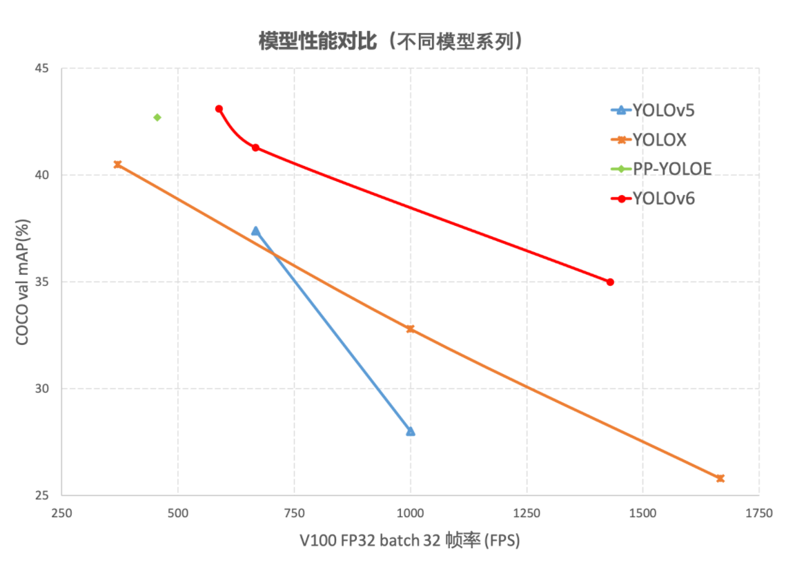
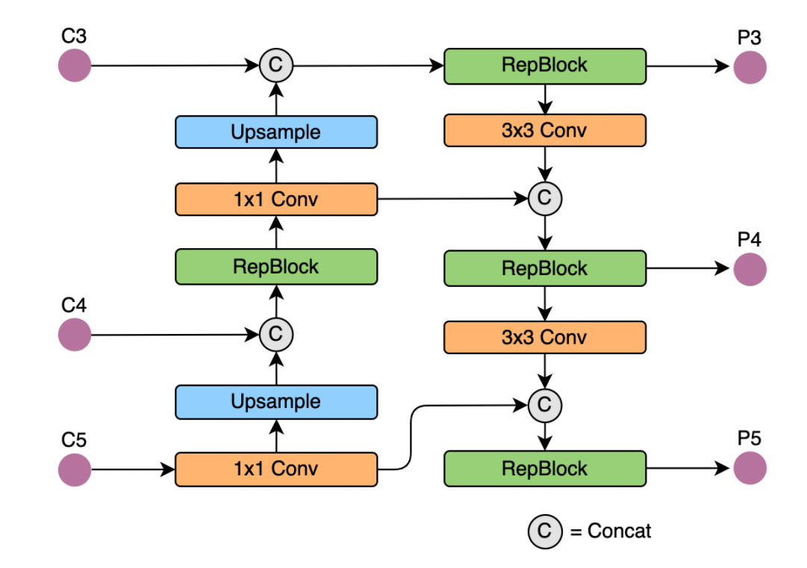

### 前言

近日，美团视觉智能部开源了YOLOv6的框架。YOLOv4、YOLOv5更多是注重于数据增强，而对网络结构的改动则比较少。和YOLOv4、YOLOv5不同，YOLOv6对网络结构的改动还是蛮大的。

从YOLOv6的报告来看，它的性能也是再创新高。YOLOv6-s在COCO上精度达到了43.1%AP，在T4上推理速度也高达520FPS！此外，YOLOv6不仅仅关注于学术界所重点关注的AP、FPS指标，对于工业界也是十分友好。在部署方面它提供了TensorRT、NCNN、OPENVINO等平台的部署。





### YOLOv6的关键技术

YOLOv6的Backbone不再使用Cspdarknet，而是转为比Rep更高效的EfficientRep；它的Neck也是基于Rep和PAN搭建了Rep-PAN；而Head则和YOLOX一样，进行了解耦，并且加入了更为高效的结构。

值得一提的是，YOLOv6也是沿用anchor-free的方式，抛弃了以前基于anchor的方法。

除了模型的结构之外，它的数据增强和YOLOv5的保持一致；而标签分配上则是和YOLOX一样，采用了simOTA；并且引入了新的边框回归损失：SIOU。这样看来，YOLOv6可谓是结合了两者的优良点。

#### Backbone

我们知道，YOLOv5和YOLOX都是采用多分支的残差结构CSPNet，但是这种结构对于硬件来说并不是很友好。所以为了更加适应GPU设备，在backbone上就引入了ReVGG的结构，并且基于硬件又进行了改良，提出了效率更高的EfficientRep。

RepVGG为每一个3×3的卷积添加平行了一个1x1的卷积分支和恒等映射的分支。这种结构就构成了构成一个RepVGG Block。和ResNet不同的是，RepVGG是每一层都添加这种结构，而ResNet是每隔两层或者三层才添加。RepVGG介绍称，通过融合而成的3x3卷积结构，对计算密集型的硬件设备很友好。


RegVGG是一种简单又强力的CNN结构，在训练时使用了性能高的多分支模型，而在推理时使用了速度快、省内存的单路模型，也是更具备速度和精度的均衡。

EfficientRep将在backbone中stride=2的卷积层换成了stride=2的RepConv层。并且也将CSP-Block修改为了RepBlock。


#### Neck

同样为了降低在硬件上的延时，在Neck上的特征融合结构中也引入了Rep结构。在Neck中使用的是Rep-PAN。

Rep-PAN是基于PAN和RepBlock两者的结合。主要就是替换PAN中的CSP-Block为RepBlock。





#### Head

和YOLOX一样，YOLOv6也对检测头进行了解耦，分开了边框回归与类别分类的过程。将边框回归和类别分类耦合在一起时会影响性能，因为这样不仅加慢收敛的速度，也会提高检测头的复杂程度。

因为在YOLOX的解耦头中，新增了两个额外的3x3卷积，这样也会一定程度增加运算的复杂度。YOLOv6基于Hybrid Channels的策略重新设计出了一个更高效的解耦头结构。在不怎么改变精度的情况下降低延时，这样也达到了速度与精度的权衡。


#### Anchor-free

传统的目标检测都是基于anchor的，如今，anchor-free的使用越来越广。因为使用anchor会存在以下几个问题：

​	1.需要在训练之前进行聚类分析以确定最佳anchor集合，但是这些anchor集合存在数据相关性，泛化性能较差。

​	2. anchor机制提升了检测头的复杂度。

#### SimOTA

SimOTA主要用于正样本的匹配，即为不同目标设定不同的正样本数量。我们知道检测模型推理的过程中会出现正负样本不均衡的现象，所以就需要进行正负样本的平均。

传统的anchor-free版本仅仅对每个目标赋予一个正样本，而忽视了其他高质量预测。因此这里为每个中心点赋予了多个正样本。并且为每个GT分配不同数量的anchor。所用的策略是参考FCOS，赋予中心3×3区域为正样本。落入其中区域的都为正样本。

SimOTA实际就是为各个GT框进行anchor的分配。分配策略可以理解为，根据不同anchor的模糊程度赋予不同的权重，从而得到分配的数量。因为在OTA中，将模糊的anchor分配给任何GT或背景都会对其他GT的梯度造成不利影响。所以，对模糊anchor样本的分配策略是特殊的。为此，需要进行更优的分配策略：除了考虑分类信息，还考虑了位置信息。也就是为图像中的所有GT对象找到全局的高置信度进行分配。

但是这里又引入了一个问题：最优运输问题优化会带来25%的额外训练耗时。所以在YOLOX中，又简化为动态的top-k策略进行分配，也就是得到一个近似解的策略：SimOTA。YOLOv6也沿用这个标签分配的方法。

#### SIOU

SIOU是2022年5月提出的。常用的IOU损失有IOU、GIOU、DIOU等，它们引入了框与框之间的重叠程度、中心点距离等等因素来进行匹配。而SIOU 损失函数是引入了所需回归之间的向量角度。这样就重新定义了距离损失，有效降低了回归的自由度，从而加速网络的收敛，进一步提升回归的准确性。


### 实验结果

以下是多种修改后的消融实验结果，可以看到，经过不断的改进，模型的mAP和FPS都获得了明显的增益。


以下是YOLOv6和目前比较主流的YOLO系列算法比较的结果，包括速度、参数量等指标：


### 使用细节

从github上的readme来看，训练的方式也比较常规，总体来说，和YOLOv5、YOLOX的挺类似，使用的还是大家比较熟悉的方式。

#### 训练前的准备

首先需要根据requirements.txt安装，里面也没有什么太特别的库。就是torch、torchvision、opencv-python、onnx这一些常规库。

然后就需要准备数据集了。依旧是每张图片对应一个标签，每一行代表一个物体。标签的格式如下：

```python
# class_id center_x center_y bbox_width bbox_height
0 0.300926 0.617063 0.601852 0.765873
1 0.575 0.319531 0.4 0.551562
```

注意类别数目需要从0开始，并且宽、中心点需要进行归一化，也就是除以图片的宽高。

接下里就可以组织你的训练集和评估集，它们的文件夹组成如下：

```python
# image directory
path/to/data/images/train/im0.jpg
path/to/data/images/val/im1.jpg
path/to/data/images/test/im2.jpg

# label directory
path/to/data/labels/train/im0.txt
path/to/data/labels/val/im1.txt
path/to/data/labels/test/im2.txt
```

这里也有YAML文件和config文件，可以高效地进行配置。这样一来，你就只需要在这些文件里修改就行了，而不需要改动代码，也不需要在整个项目中，东挑一个文件进行改动，西选一个文件进行修改。

```python
# 这是dataset.yaml
train: path/to/data/images/train # train images
val: path/to/data/images/val # val images
test: path/to/data/images/test # test images (optional)

# Classes
nc: 20  # number of classes
names: ['aeroplane', 'bicycle', 'bird', 'boat', 'bottle', 'bus', 'car', 'cat', 'chair', 'cow', 'diningtable', 'dog',
        'horse', 'motorbike', 'person', 'pottedplant', 'sheep', 'sofa', 'train', 'tvmonitor']  # class names

```

```python
## 这是模型配置文件
model = dict(
    type='YOLOv6s',
    pretrained='./weights/yolov6s.pt', # download pretrain model from YOLOv6 github if use pretrained model
    depth_multiple = 0.33,
    width_multiple = 0.50,
    ...
)
solver=dict(
    optim='SGD',
    lr_scheduler='Cosine',
    ...
)

data_aug = dict(
    hsv_h=0.015,
    hsv_s=0.7,
    hsv_v=0.4,
    ...
)
```

#### 训练

这是训练的命令：

```python
python tools/train.py --batch 256 --conf configs/yolov6s.py --data data/coco.yaml --device 0
                                         configs/yolov6n.py
```

以上是单卡训练的命令，如果你想使用多卡训练，可以用以下的命令：

```python
python -m torch.distributed.launch --nproc_per_node 8 tools/train.py --batch 256 --conf configs/yolov6s.py --data data/coco.yaml --device 0,1,2,3,4,5,6,7
                                                                                        configs/yolov6n.py
```

#### 评估

训练完后，用于评估的命令：

```python
python tools/eval.py --data data/coco.yaml  --batch 32 --weights yolov6s.pt --task val
                                                                 yolov6n.pt
```

#### 测试

进行测试推理，可以使用以下命令：

```python
python tools/infer.py --weights yolov6s.pt --source [img.jpg / imgdir]
                                yolov6n.pt
```

#### 部署

如果你需要进行部署，就需要进行export转换，以转为onnx为例：

```python
python deploy/ONNX/export_onnx.py --weights output_dir/name/weights/best_ckpt.pt --device 0
```

### 文末

以上，就是对于YOLOv6的初步品尝。可以看到，YOLOv6使用了不同的改良策略后，性能的提升都是立竿见影的。从在COCO数据集上的实验结果来看，YOLOv6 在目标检测算法中可谓是一马当先了。

并且如今的开源项目，对于工业上的部署也越来越支持了，完全考虑到了如今工程师们的刚需。虽然提升性能这一项"做好"工作很重要，但是工业部署上的“做到”更加重要。这也是我们在工作中需要考虑的一点：有时完成比完美更加重要，做好的前提是做到。只有先做到，才有后面的做好。

### 参考链接

https://arxiv.org/pdf/2101.03697.pdf

https://arxiv.org/pdf/2107.08430.pdf

https://arxiv.org/ftp/arxiv/papers/2205/2205.12740.pdf

https://arxiv.org/ftp/arxiv/papers/2205/2205.12740.pdf

https://tech.meituan.com/2022/06/23/yolov6-a-fast-and-accurate-target-detection-framework-is-opening-source.html

https://github.com/meituan/YOLOv6


