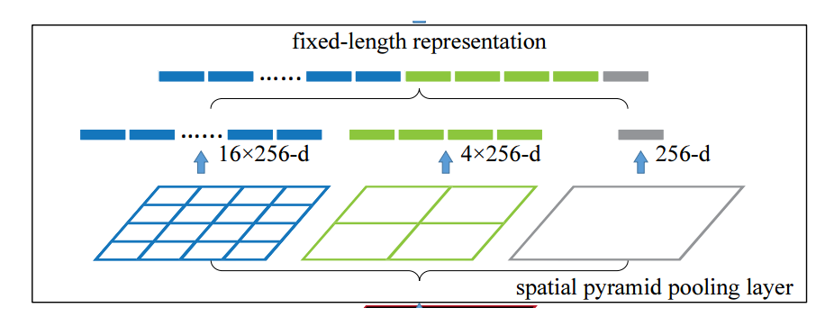

## **前言**

今天，笔者在这里介绍 YOLOv4 ，很多人都发现了，其实 YOLOv4 在本身上并没有太多创新点，但却加入了大量的 tricks，并在此基础上进行了各种魔改，从而实现速度和精度的完美平衡。

## **Bag of freebies 和 Bag of specials**

- Bag of freebies 是指采用一些方法使模型有更高的准确度但是不增加模型的复杂度和模型的推理代价。
- Bag of specials 是指 plugin module 或后置方法以些许推理代价的增加换取模型准确率的提升。

**Backbone 中包含的BoF：**

- CutMix
- Mosaic 数据增强
- DropBlock 正则化类
- 标签平滑

**Backbone 中包含的BoS：**

- Mish 激活函数
- CSP 结构
- 多输入权重残差连接（MiWRC）

**其它部分所包含的 BoF：**

- CIOU损失
- CｍBN
- Cross mini-Batch Normalization
- CBN 的改进版本。它只收集了一个批次中的 mini-batches 之间的统计数据
- DropBlock 正则化
- Mosaic 数据增强
- 自对抗（SAT）
- Cosine 退火算法
- 优化超参数
- 训练随机输入图像尺寸。

**其它部分所包含的 BoS：**

- Mish 激活函数
- SPP 模块
- SAM 模块 将 SAM 的 spatial-wise 注意力改为 point-wise 注意了机制
- PAN路径集成模块 将 PAN 中的 shortcut 连接变成 concatenation 连接
- DIOU-NMS

## **Backbone 部分**

**CSPDarknet53**

CSPDarknet53 的全称是Cross Stage Paritial Network，作者的初衷是想从网络的结构出发，来解决在推理过程中计算量过大的问题。

这一目标是通过将基础层的特征映射划分为两部分，然后通过提出的跨阶段层次结构再将它们合并，可以实现更丰富的梯度组合。作者通过对梯度流的分裂使梯度流通过不同的网络路径传播，并且证实了可以增强 CNN 的学习能力。

CSPNet 的作者认为推理计算过高的问题是由于网络优化中的梯度信息重复导致的。所以作者将输入的基础特征进行两路的划分，并利用两路的 1 x 1 卷积对基础层的特征进行变换，最后再通过跨阶段层次结构将它们合并。这样比直接划分通道起到进一步提高特征复用性的作用，并且在输出到后面 resiudal block 之前也确实实现了通道数的减半，从而减少了计算量。

此外，CSPNet通过两路的划分与变换，这是直接用两路的1x1卷积将输入特征进行变换。将全部的输入特征利用两路 1 x 1 进行 transition，比直接划分通道能够进一步提高特征的重用性，并且在输入到 resiudal block 之前也确实通道减半，减少了计算量。不但可以大大减少计算量、提高推理速度和准确性，而且可以实现更丰富的梯度组合。

**CSP 中的基本组件**

CBM：Yolov4 网络结构中的最小组件，由 Conv + Bn + Mish 激活函数三者组成。

CBL：由 Conv + Bn + Leaky_relu 激活函数三者组成。

Res unit：借鉴 Resnet 网络中的残差结构，让网络可以构建的更深。

CSPX：借鉴 CSPNet 网络结构，由卷积层和X个 Res unint 模块 Concate 所组成。

**CSP的优点**

优点一 ： 增强CNN的学习能力，使得在轻量化的同时保持准确性

优点二 ： 降低计算瓶颈

优点三 ： 降低内存成本

**Mish激活函数**

YOLOv4 只在 Backbone 中采用了 Mish 激活函数，网络后面仍然使用原来的 Leaky_relu 激活函数。

作者在实验的过程中，发现在 CSPDarknet53 中使用Mish激活函数在 ImageNet 数据集上，网络输出的 TOP-1 和 TOP-5 的精度都高一些。所以在 Yolov4 的主干网络 Backbone 中使用 Mish 激活函数。

Mish 激活函数 Mish = x * tanh(ln(1 + e^x)) 平滑的激活函数允许更好的信息深入神经网络，从而获取效果更佳的准确性和泛化能力。

**Dropblock**

Dropout 的主要作用就是随机使一些特征失活，是缓解过拟合的一种正则化手段。一般作用在全连接层。Dropout 在全连接层是可以起到作用的，但在卷积层上作用并不明显。因为卷积层上的特征是空间相关的，并且一般卷积之后都有池化，池化层本身就是对相邻单元起作用。即使有 dropout 的存在，相关的信息仍能正常传递给下一层。

而在 DropBlock 中，是将特征层中的局部区域丢弃掉，而不是某几个特征。当网络失去了某些相关区域的连续特征后，为了继续拟合，那么网络就不得不往不同的方向进行更新，从而减少过拟合的程度。

其实 Dropblock 是借鉴 Cutout 的，并且对比之后发现 Dropblock 更优：

- Cutout 只能作用于输入层，而 Dropblock 则是将 Cutout 应用到网络中的每一个特征图上
- Dropblock 可以定制各种组合，在训练的不同阶段可以修改删减的概率，从空间层面和时间层面，和 Cutout 相比都有更精细的改进。

## **Neck部分**

**SPP** 

SPP 是空间金字塔池化网络，它采用1 × 1，5 × 5，9 × 9，13 × 13的最大池化的方式，将输入的特征图进行不同尺度的最大池化，再进行多尺度融合，这样可以提高感受野，分离出最显著的上下文特征，并且几乎没有降低网络运行速度。但更重要的作用是可以让任意大小的特征图都能够转换成固定大小的输出，那么，当 SPP 后面接入全连接层时，则可以输出固定大小的特征图给全连接层。

通过使用 SPP 模块，比单纯的使用 k x k 的最大池化，能更有效的加强特征提取，从而显著的分离了最重要的上下文特征。

**FPN + PAN**	

FPN 是自顶向下的金字塔，将特征层的宽高进行缩减；而 PAN 是自底向上的金字塔，可以恢复特征层的宽高。由于 FPN 只是将高层的语义特征传递下来，并没有传递定位信息，所以针对这一点，连接在后面的PAN就是为了传递定位信息。PAN 来源于 PANet，当时是应用于图像分割领域的，可以进一步提高特征提取的能力。

在这里，PAN 中的 shortcut 连接变成 concatenation 连接，所以融合后的尺寸会发生改变。

## **Head 部分**

YOLOv4 的头部与 YOLO V3 的一样。依旧是分为三个 head，分别负责大尺度、中尺度、小尺度的预测。主要改进的是训练时的损失函数 CIOU_Loss，以及预测框筛选的 nms 变为 DIOU_nms。

**IOU**

IOU 就是我们一直所说的交并比，是目标检测中最常用的指标，在 anchor-based 的方法中，它的作用不仅用来确定正样本和负样本，还可以用来评价输出框（predict box）和 ground-truth 的距离。

可以说它可以反映预测检测框与真实检测框的检测效果。

它还有一个很好的特性就是尺度不变性，也就是对尺度不敏感（scale invariant）， 在 regression 任务中，判断 predict box 和 gt 的距离最直接的指标就是 IOU。因为其满足非负性；同一性；对称性；三角不等性。

作为损失函数会出现的问题(缺点)：

- 如果两个框没有相交，根据定义，IOU = 0，不能反映两者的距离大小（重合度）。同时因为 loss = 0 时，没有梯度回传，无法进行学习训练。

- IOU 无法精确反映两者的重合度大小。如下图所示，三种情况IOU都相等，但看得出来他们的重合度是不一样的，左边的图回归的效果最好，右边的最差。

  

**GIOU**

GIOU对scale不敏感:

 \- GIOU 是 IOU 的下界，在两个框无限重合的情况下，IOU = GIOU = 1。

 \- IOU取值[0,1]，但 GIOU 有对称区间，取值范围[-1,1]。在两者重合的时候取最大值1，在两者无交集且无限远的时候取最小值-1，因此 GIOU 是一个非常好的距离度量指标。

GIOU与 IOU 只关注重叠区域不同，GIOU 不仅关注重叠区域，还关注其他的非重合区域，能更好的反映两者的重合度。

GIOU会先计算两个框的最小闭包区域面积，通俗理解：同时包含了预测框和真实框的最小框的面积，再计算出 IOU，再计算闭包区域中不属于两个框的区域占闭包区域的比重，最后用 IOU 减去这个比重，最后得到 GIOU。

当矩形框同宽高并且平行或者垂直的话，退化成 IOU。

**DIOU**

1. 将目标与anchor之间的距离，重叠率以及尺度都考虑进去，使得目标框回归变得更加稳定，不会像IoU和GIoU一样出现训练过程中发散等问题。
2. 与 GIOU loss类似，DIOU loss、在与目标框不重叠时，仍然可以为边界框提供移动方向。
   1. DIOU loss可以直接最小化两个目标框的距离，因此比GIOU loss收敛快得多。
   2. 对于包含两个框在水平方向和垂直方向上这种情况，

3. DIOU 损失可以使回归非常快，而 GIOU 损失几乎退化为 IOU 损失。DIOU 还可以替换普通的 IOU 评价策略，应用于NMS中，使得NMS得到的结果更加合理和有效。

**CIOU**

论文考虑到bbox回归三要素中的长宽比还没被考虑到计算中，因此，进一步在DIoU的基础上提出了CIoU。其惩罚项如下面公式：

其中 α 是权重函数，而 v 用来度量长宽比的相似性。在使用的过程中，要考虑 v 的梯度，长宽比在 [0, 1] 情况下，容易导致梯度爆炸。

**IOU总结**

> IOU_Loss ： 主要考虑检测框和目标框重叠面积。 GIOU_Loss ： 在 IOU 的基础上，解决边界框不重合时的问题。 DIOU_Loss ： 在 IOU 和 GIOU 的基础上，考虑边界框中心点距离的信息。 CIOU_Loss ： 在 DIOU 的基础上，考虑边界框宽高比的尺度信息。

## 其它部分

**Mosaic**

Mosaic 这个数据增强的方法类似 CutMix。CutMix 是利用两张图片进行拼接，先 cut 掉部分区域再用补丁的形式去混合图像，这样就不会有图像混合后不自然的情况；而 Mosaic 利用了四张图片。论文说使用了 Mosaic 后，可以丰富检测物体的背景，并且在 batch normal 计算的时候可以一次性对四张图片进行计算，使得 mini-batch 大小不需要很大也可以取得比较好的效果，对于只有一张 GPU 的小伙伴来说是十分友好的。

**CmBN策略**

我们知道，BN 是对当前 mini-batch 的数据进行归一化；CBN 是通过收集最近几次迭代信息来更新当前迭代时刻的均值和方差；而 CmBN 是在整个 batch 中使用 Cross min-batch Normalization 进行归一化，而不是在单独的 mini-batch 中进行归一化。

可以明显发现 CmBN 是 CBN 的简化版本，其唯一差别就是在计算第t时刻的 BN 统计量时候，CBN 会考虑前一个 mini batch 内部的统计量，而 CmBN 的所有计算都是在 mini batch 内部进行。

**SAT**

SAT 是自对抗训练（self-adversarial-training，SAT）。SAT 是一种新的数据增强方法，它分为两个阶段。在第一个阶段，网络会修改原来的图像但是不改变网络的权重，通过这种方式，网络自己进行对抗训练，改变原始图像，造成图像上没有需要的物体的假象；而在第二阶段中，网络会以正常方式在修改后的图像上进行训练，消除 grid 敏感度，以及对于一个 ground truth 使用多个 anchor。

**SAM**

SAM 模块是注意力模块，YOLOv4 将 SAM 的 spatial-wise 注意力改为 point-wise 。并且在SAM中没有使用 pooling ，而是直接用一个卷积进行代替，再使用 sigmoid 进行激活，然后对应点相乘，所以说改进后的模型是 point-wise attention。

**余弦模拟退火调整学习率 Cosine annealing scheduler**

使得学习率按照周期变化，在一个周期内先下降，之后上升。根据余弦函数调整学习率。 它从缓慢降低大的学习率开始。 然后在中途迅速降低学习率，最终学习率慢慢降至微小值。

**Random Training Shapes**

为了减小模型的过拟合，在训练过程中更改输入图片的大小，每隔多少个epoch就随机的{320, 352, 384, 416, 448, 480, 512, 544, 576, 608}中选择一个尺寸作为图片的尺寸。

**MiWRC(Multi-input weighted residual connection)**

多输入加权残差连接这个方法来自于 EfficientDet，也就是 EfficientDet 中说的带权重特征融合(Weighted Feature Fusion)，在 EfficientDet 中说到，不同的输入特征在不同的分辨率下，对输出特征的贡献是不一样的，是不均匀的。所以这里就希望在输入特征合成输出特征时，赋予不同的权重。 

**Label Smoothing**

对于传统方法来说，100% 相信一个预测可能会导致这个模型是在记忆数据而不是在学习。 标签平滑将预测的目标上限调整为一个较低的数值，比如0.75。 它将使用这个值而不是绝对的1.0来参与损失的计算，使得标签在某种程度上软化，增加了模型的泛化能力，一定程度上可以减缓过拟合。从某种意义上来说，可以看作是一种正则化方法。

标签平滑强制对分类结果进行更紧密的分组，同时强制在聚类之间进行更等距的间隔。也就是说，标签平滑产生了更紧密的聚类和更大的类别间的分离。

如上图，对于二分类来说。结果不再是[0,1]了，而是修改了并赋予不同的惩罚。

## **参考链接**

https://zhuanlan.zhihu.com/p/143747206

https://blog.csdn.net/x454045816/article/details/109759989

https://blog.csdn.net/WZZ18191171661/article/details/113765995

https://zhuanlan.zhihu.com/p/342570549

https://zhuanlan.zhihu.com/p/139764729

## **论文链接**

YOLOv4 : https://arxiv.org/abs/2004.10934

## **文末**

以上就是关于 YOLOv4 的内容，后续笔者还会继续写关于 YOLOv5 的知识以及关于部署方面的文章。大家敬请期待！

