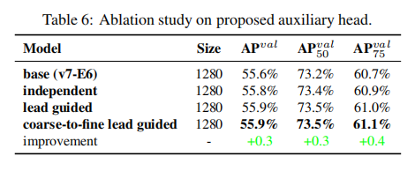

### 前言

在YOLOv6出来不久后，YOLOv7就立马横空出世了。我们知道YOLOv5和YOLOv6都不是出自于官方团队。与YOLOv5、YOLOv6不同，YOLOv7是由YOLOv4团队的原班人马提出的。从论文的表上来看，目前YOLOv7无论是在实时性还是准确率上都已经超过了目前已知的所有目标检测算法。并且它在COCO数据集上达到了56.8%的AP。

### 创新点

作者主要从两点进行模型的优化：模型结构重参化和动态标签分配。

从近几年来看，模型结构重参化和动态标签分配已经成为了目标检测领域中的主要优化方向。针对于结构重参化，YOLOv7的作者是通过分析梯度的传播路径来为网络中的不同层进行结构重参化优化，并且提出了不同规划的模型结构重参化。在动态标签分配上，因为模型有多个输出层，所以在训练时就难以为不同的分支分配更好地动态目标。所以作者提出了一个新的动态标签分配办法：coarse-to-fine，即由粗到细引导标签分配的策略。                                                                                                   

除了以上两点，作者还提出了扩展和复合缩放的方式，通过这种方式可以更高效利用参数量和计算量。这样不仅可以减少大量参数，还可以提高推理速度以及检测精度。这个其实和YOLOv5或者YOLOv4所使用不同规格分化成几种模型类似，既可以是width和depth的缩放，也可以是module的缩放。

并且设计了几个可以训练的bag-of-freebies。这样使得模型在不更改本身结构时，大大提高检测精度。

### 详细设计

#### 高效的聚合网络设计

为了增强网络的实时性检测，研究者们一般会从模型的参数量、计算量、内存访问次数、输入输出的通道比、element-wise操作等方面分析参数的数量、计算量和计算密度。其实这些研究方法和当时的ShuffleNetV2是差不多的。
YOLOv7里使用的是CSPVOVNet， 是VoVNet的一种变体。CSPVoVNet不仅考虑到了前面所提到的模型设计问题，还分析了梯度的在模型中流动路径，通过这个来使得不同层的权重能够学习到更加多样化的特征。不管是训练阶段还是推理阶段，以上方法都能起到不错的效果，尤其是在推理方面。可以提升推理的速度与精度。

此外，作者还提出了基于ELAN的Extended-ELAN，也就是E-ELAN方法。通过高效长程注意力网络来控制梯度的最短最长路径，让更深的网络可以更加高效地学习和收敛。作者提出的E-ELAN使用expand、shuffle、merge cardinality来实现在不破坏原有梯度路径的情况下，提升网络的学习能力。无论梯度路径长度和大规模ELAN中计算块的堆叠数量如何，网络都能够达到稳定状态，但是倘若继续这样一直地堆叠这一些计算块下去，反而可能会破坏这种稳定的状态，从而导致降低参数的利用率。

在结构方面，E-ELAN只改变块本身的架构，对于过渡层的架构则没有改变，这边的调整策略是使用组卷积来扩展计算块的通道和基数，将对计算层的所有计算块应用相同的组参数和通道数，然后，对于每个计算块输出的特征图会根据设置的组参数g被随即打乱成g个组，之后再将它们连接在一起。注意到这个时候，每组特征图的通道数和原来架构中的通道数是一样的，最后，添加g组的特征图来执行合并基数。
E-ELAN除了保持原有的ELAN设计架构外，还可以帮助其它组的计算块学习到更加多样化的特征。

#### 卷积重参化

重参化技术是模型在推理时将多个模块合并成一个模块的方法，其实就是一种集成技术。常见的重参化技术有：

- 一种是用不同的训练数据训练多个相同的模型，然后对多个训练模型的权重进行平均。
- 一种是对不同迭代次数下模型权重进行加权平均。

虽然RepConv在VGG上取得了很不错的效果，但将它直接应用于ResNet和DenseNet或其他骨干网络时，它的精度却下降得很厉害。作者就是用梯度传播路径的方法来分析，因为RepConv结合了3×3卷积，1×1卷积，和在一个卷积层中的identity连接，可是这个identity破坏力ResNet的残差连接以及DenseNet的跨层连接，为不同的特征图提供了更多的梯度多样性。

因此，作者认为，在同时使用重参化卷积和残差连接或者跨层连接时，不应该存在identity连接，而且作者还分析重参数化的卷积应该如何与不同的网络结构相结合以及设计了不同的重参数化的卷积。

#### 基于concatenate的模型缩放

模型缩放是调整模型的大小来生成不同尺度的模型，用于满足不同场景下的推理需求。
如今的网络中，主要的缩放因子有input size、depth、width、stage，通过控制这些参数，模型的参数量、计算量、推理速度和精度都有一个很好的平衡。同时，网络架构搜索NAS技术也经常使用到。其实这里和YOLO4、YOLOv5差不多，YOLOv4是通过调整模型阶段数，而YOLOv5是通过控制它的深度、宽度进行模型的缩放。

作作者还发现，使用了concatenate模型时，不能单独地分析缩放因子的影响，还必须结合通道数的变化一起分析，因为在这过程中会导致输入通道和输出通道的比例会发生变化，从而导致模型的硬件使用率降低。所以，这里该团队还提出了一种复合缩放方法，这样不仅可以保持模型在初始设计时的特性还可以保持性能最佳时的结构。这种方法就是在缩放一个计算块的深度因子时，还必须结合这个块的输出通道的变化进行计算。在对过渡层用相同的变化量进行宽度因子缩放，就可以保持模型在不改变初始设计时的特性的同时保持更优的结构。

#### **标签分配**

在网络的训练中，标签分配通常是指GT，这个是硬标签，但近年来，需要研究者会利用网络的推理结果来结合GT，去生成一些软标签，如IOU。在YOLOv7中，有辅助头也有引导头，在训练时，它们二者都需要得到监督。因此，需要考虑如何为辅助头和引导头进行标签分配。
因此在这里，作者提出了一种新的标签分配方法，是以引导头为主，通过引导头的推理来指引辅助头和自身的学习。

首先使用引导头的推理结果作为指导，生成从粗到细的层次标签，分别用于辅助头和引导头的学习。

1. Lead head guided label assigner  引导头引导标签分配
   引导头引导标签分配是根据引导头的预测结果和GT进行一系列优化计算来生成软标签，然后软标签作为辅助头和引导头的优化方向来训练模型。这样是由于引导头本身具备比较强的学习能力，因此由此产生的软标签应该更能代表源数据与目标之间的分布和相关性，而且还可以将这种方式当作是一种广义上的余量学习。通过让较浅的辅助头直接学习引导头已经学习到的信息，然后引导头就更能专注于学习到它还没有学习到的剩余信息。
2. Coarse-to-fine lead head guided label assigner 从粗到细的引导头引导标签分配
   Coarse-to-fine引导头使用到了自身引导头的推理结果GT来生成软标签，进而引导标签进行分配。 然而，在这个过程中会生成两组不同的软标签，即粗标签和细标签， 其中细标签与引导头在标签分配器上生成的软标签是一样的，粗标签是通过允许更多的网格作为正目标，不单单只把gt中心点所在的网格当成候选目标，还把附近的三个也加进来了，增加正样本候选框的数量，以降低正样本分配的约束。因为辅助头的学习能力没有指导头强，所以为了避免丢失需要学习的信息，就提高辅助头的召回率，对于引导头的输出，可以从查准率中过滤出高精度值的结果作为最终输出。

但是如果粗标签的附加权重和细标签的附加权重差不多，那么在最终预测时就可能产生错误的先验结果。因此，为了使那些超粗的正网格影响更小，会在解码器中设置限制，来使超粗的正网格无法完美地产生软标签。通过以上的机制，允许在学习过程中动态调整细标签和粗标签的重要性，使细标签的始终优于粗标签。

由以下的实验结果来看，通过从粗到细的引导头引导标签分配以及约束可以获得更好的性能。

#### 训练时的其它策略

- Batch Normalization：即将Batch Normalization层直接连接到卷积层中。这样可以在推理时将Batch Normalization的均值和方差直接融合到卷积层的偏差和权重中。
- YOLOR中结合隐性知识和卷积特征图的加法和乘法方法：在YOLOR中，它认为隐式知识可以在推理时通过预计算步骤被简化为向量。然后再把这个向量和前一个或后一个卷积层的偏差和权重融合在一起。
-  EMA：EMA是一种在mean teacher中使用的技术，在系统中使用EMA模型纯粹作为最终的推理模型。EMA可以用来估计变量的局部均值，使得变量的更新与一段时间内的历史取值有关，这里可以取得平滑的作用。如果取n步的平均，就能使得模型更加得鲁棒。

### 实验结果

作者为边缘GPU、普通GPU、高性能云GPU三种不同场景设计了三种模型，分别是YOLOv7-Tiny、YOLOv7和YOLOv7-W6。并且通过论文中的复合缩放方法，对整个模型的深度、宽度进行缩放，得到了YOLOv7-X、YOLOv7-E6和YOLOv7-D6。以及在YOLOv7-E6基础上使用了E-ELAN技术来获得YOLOv7-E6E。

可以看到以下和其他目标检测器的速度、精度对比结果。

在这里提一下不同场景下的计算设备。

- GPU边缘设备：近年来，针对于低功耗的移动端设备，如NanoDet，也提出了不少的目标检测算法。这些算法主要是专注于在高效的结构设计上，这样在保持推理精度的同时也可以提高推理的实时性。
- CPU边缘设备：对于这种场景，更多的是使用轻量级的Backbone，如MobileNet、ShuffleNet或GhostNet。
- 高性能GPU设备：这些设备大多是高算力GPU、云端GPU，对于这种场景，运行大模型也是没有什么压力的。

### 参考链接

https://arxiv.org/pdf/2207.02696.pdf

https://github.com/WongKinYiu/yolov7

### 文末

YOLOv7主要是针对重参化模块、动态标签替换这两方面进行优化。除了这些，为了不提高模型本身的复杂性，作者团队还提出了可训练的bag-of-freebies策略来提高检测的精度。从实验结果上来看，作者开源出来的YOLOv7已经获得了最先进的结果，是目前最新、最高效的目标检测器。

如今新技术的更新速度越来越快，我们可以理解其中的原理及应用场景。但是在实际场景可以不用频繁地替换新模型，而是在原来的业务模型中沉淀下来，去思考如何更好地去改进，这样就可以即学习到都新知识，又省下了替换过程中所花费的成本了！
