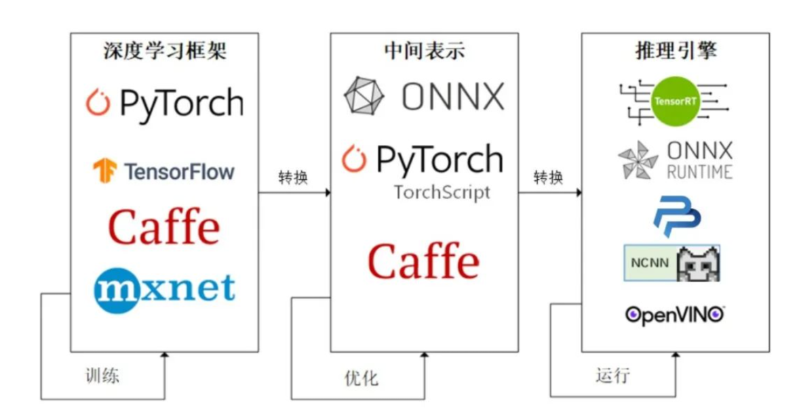
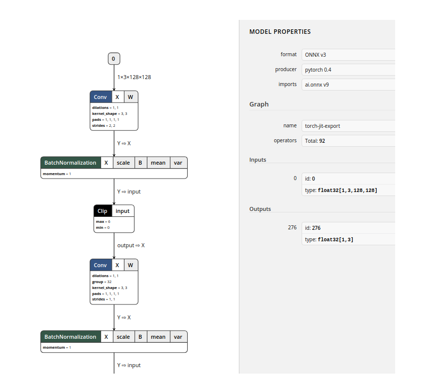

## 前言


前面几篇分别介绍了 YOLOv3 - YOLOv5 的原理，今天这里就介绍下关于 YOLO 的部署。在讲解之前，我先介绍一下 ONNX，这个 ONNX 是什么呢？


## **ONNX**


ONNX 是什么呢？我们平常一般会在 pytorch、tensorflow、paddlepaddle 上进行模型的开发与训练，这些框架其实并不相通，那么部署起来的话，pytorch 的模型就只能部署在 pytorch 框架上，而不能在 tensorflow 上运行。这时我们就想使用一个通用的结构，通过这个结构，可以适应 pytorch 的模型，也可以适应 caffe 的模型，以及其他框架的模型，甚至适合在手机、开发板这些环境上运行。


那么 ONNX就起到这个作用。我们可以使用任意一种深度学习的框架来训练网络，然后将模型的结构与参数都转换为一种通用的中间表示，最后使这个中间结构来适应不同的推理引擎。这样我们在部署时，就可以不用考虑深度学习框架的限制了。我们不仅不用担心怎么运行各个复杂的框架，我们还可以通过这个中间表示来对网络结构进行优化，使模型在推理的过程中，大大提高运算效率。


### **ONNX 的转换路径**


- Pytorch -> ONNX -> TensorRT
- Pytorch -> ONNX -> NCNN





ONNX 也叫 Open Neural Network Exchange，是由 Facebook 和微软共同开发的，用于标准描述计算图的一种格式，使得不同的框架都可以采用相同的格式来存储模型的数据，可以适应不同的训练框架和推理引擎，并且可以使模型在不同框架之间进行转移，增强各种 AI 模型的可交互性，同时也是他们两者之间的媒介。


ONNX 采用的是 protobuf 这个序列化数据结构协议来存储神经网络权重信息。使用过 tensorflow、caffe 应该比较熟悉 protobuf，protobuf 是一种与平台无关、语言无关、可扩展且轻便高效的序列化数据结构的协议，可以用于网络通信和数据存储，并且提供了 C++、Python 的 API。


我们可以通过 protobuf 来设计出一种数据结构的协议，然后使用其它语言去读取、解析、写入。ONNX 中采用onnx.proto 定义 ONNX 的数据协议规则和一些其他的信息。同样，也可以借助 protobuf 来解析 ONNX 模型。


### **ONNX 的组成组件**


- 可扩展计算图模型的定义
- 标准数据类型的定义
- 内置运算符的定义


### **ONNX模型解析流程**


- 读取 ONNX 文件，获得 model 结构；
- 通过 model 结构访问 graph 结构；
- 通过 graph 访问整个网络的所有 node 以及 inputs、outputs；
- 通过 node 结构，可以获取每一个 OP 的参数信息。
- 其中 graph 结构中还定义了 initializer 和 value_info，分别存放了模型的权重参数和每个节点的输出信息。


### **ONNX 模型构建流程**


- 根据网络结构 make_node 创建相关节点，节点的 inputs 和 outputs 参数决定了 graph 的连接情况；
- 利用定义好的节点然后使用 make_graph 生成计算图；
- 利用 graph make_model；
- 检查模型无误后就保存。


### **ONNX** **的参数**


> 使用 ONNX 也很简单，直接 pip install onnx 即可。下面介绍一下导出为 ONNX 时需要用到以下常用的参数：


**model：**就是需要转为 ONNX 的源 pth 模型，只有源模型的结构和权重，才能转化为有效的 ONNX 模型。

**args：**支持单个参数或者多个参数。任何非变量参数将被硬编码到导出的模型中，按照它们在参数中出现的顺序，任何变量参数都将成为输出模型的输入。它指的是模型的输入，只要满足输入张量的 shape正确就可以。因为对于导出来说，我们只需关心张量从输入到输出的所流经的路径是否就可以了，而不关心它的结果是否正确。一般来说这个是固定大小的。

**f：**导出 ONNX 的位置，指定好后就会在相应的地方保存好成功导出的 ONNX。

**export_params：**代表是否存储模型的权重，默认为 True，为 True 则将所有参数将被导出。因为与 pytorch 不同，pytorch 的模型结构和权重是可以存储在在同一文件里，也可以存储在不同文件中，但 ONNX 存储在一块的。ONNX 格式的权重文件，不仅包含了权重值，也包含了网络中每一层的输入输出信息以及其他辅助信息。

**verbose：**表示是否打印调试的信息。

**traning：**默认为False，如果指定为True，将在训练模式下导出模型。一般来说 ONNX 只是为了导出模型，所以你通常不需要将其设置为True。

**input_names：**是模型的输入节点名称，如果不设置的话，会自动分配一些简单的数字作为名称。

**output_names：**是模型的输出节点名称，和上面一样。ONNX 是通过这些名称来获取输出数据的。

**opset_version：**默认为9，表示的是转换时是使用哪个 ONNX 算子集版本。如果版本过低，就不支持 upsample 等操作。详情可看 https://github.com/onnx/onnx/blob/main/docs/Operators.md

**do_constant_folding：**默认为 False。如果为 True，则在导出期间将常量折叠优化应用于模型。常量折叠优化将用预先计算的常量节点替换一些具有所有常量输入的操作。

**example_outputs：**是 tensor 类型 表示正在导出的模型示例输出。导出 ScriptModule 或 TorchScript 函数时必须提供“example_outputs”。如果有多个项目，则应以元组格式传递，例如：example_outputs = (x, y, z)。否则，只应传递一项作为示例输出，例如 example_outputs=x。导出 ScriptModule 或 TorchScript 函数时必须提供 example_outputs。

**strip_doc_string：**default True。如果为 True，则从导出的模型中删除字段“doc_string”，其中包含有关堆栈跟踪的信息。

**dynamic_axes：**用于指定输入/输出的动态轴的字典，例如： - KEY：输入和/或输出名称 - VALUE：给定键的动态轴索引以及可能用于导出动态轴的名称。通常，根据以下方式之一或两者的组合来定义该值： (1)。指定所提供输入的动态轴的整数列表。在这种情况下，将生成自动名称并将其应用于导出期间提供的输入/输出的动态轴。或 (2)。一个内部字典，指定从相应输入/输出中的动态轴索引到导出期间希望应用于此类输入/输出的此类轴的名称的映射。ONNX 默认输入的张量是固定大小的，这样做的原因是为了提高效率。但是在实际使用中，我们输入的张量可能是动态的，特别是对于没有输入限制的全卷积网络，所以我们可以通过这个来指定输入输出张量中，哪些维度是可以动态改变的。

**keep_initializers_as_inputs：**默认为 None。如果为 True，导出图中的所有初始值设定项（通常对应于参数）也将作为输入添加到图中。如果为 False，则初始值设定项不会作为输入添加到图形中，而仅将非参数输入添加为输入。

**custom_opsets：**用于在导出时指示自定义 opset 域和版本的字典。如果模型包含自定义操作集，则可以选择在字典中指定域和操作集版本： - KEY：操作集域名 - VALUE：操作集版本如果此字典中未提供自定义操作集，则操作集版本设置为 1默认。

**enable_onnx_checker：**默认为 True。如果为 True，onnx 模型检查器将作为导出的一部分运行，以确保导出的模型是有效的 ONNX 模型。

**use_external_data_format：**默认为 False。如果为 True，则模型以 ONNX 外部数据格式导出，在这种情况下，某些模型参数存储在外部二进制文件中，而不是存储在 ONNX 模型文件本身中。


## **Netron**


我们在训练模型的时候，可能会觉得玄学、云里雾里的，因为没有一个可视化过程，但是模型可视化的过程却很重要。netron 就是一个网络结构的可视化神器。我们可以通过它来查看网络的结构。   





netron 不仅操作简单便捷，而且支持的平台也十分广泛。不管是 PTH、H5、CaffeModel 还是 ONNX，都可以通过 netron 查看。特别是你想要知道模型的输入名与输出名，都可以通过这个工具查看。


所以在转换后，我们可以查看 ONNX 是否转换正确，也可以查看它究竟做了哪一些优化。


## **YOLOv4 的部署代码**


### 参考链接


https://github.com/Tianxiaomo/pytorch-YOLOv4


### **主要的 main 函数**


```python
def main(cfg_file, namesfile, weight_file, image_path, batch_size):

    if batch_size <= 0:
        # 当小于0的时候一般为-1，即不会指定 batch size，那么就根据batch size的不同大小来导出onnx
        onnx_path_demo = transform_to_onnx(cfg_file, weight_file, batch_size)
    else:
        # 根据batch size的不同大小导出onnx
        transform_to_onnx(cfg_file, weight_file, batch_size)
        # 以默认的batch size为1导出onnx
        onnx_path_demo = transform_to_onnx(cfg_file, weight_file, 1)

    session = onnxruntime.InferenceSession(onnx_path_demo)	# 根据导出的onnx所在路径，构造推理引擎并初始化
    # session = onnx.load(onnx_path)
    print("The model expects input shape: ", session.get_inputs()[0].shape)

    image_src = cv2.imread(image_path)	# 常规的读取图片
    detect(session, image_src, 'data/coco.names')	# 进行检测
```


### **导出为 onnx 的 transform_to_onnx 函数**


```python
def transform_to_onnx(weight_file, batch_size, n_classes, IN_IMAGE_H, IN_IMAGE_W):
    
    model = Yolov4(n_classes=n_classes, inference=True)     # 定义模型

    pretrained_dict = torch.load(weight_file, map_location=torch.device('cpu'))     # 加载权重
    new_dict = {}
    for index, (key, value) in enumerate(pretrained_dict.items()):
        if "neek" in key:
            key = key.replace('neek', 'neck')   # 权重名称和模型结构的名称不一致，替换权重的名称
        new_dict[key] = value
    model.load_state_dict(new_dict, strict=False)

    input_names = ["input"]
    output_names = ['boxes', 'confs']
    # output_names = ['feature_map_1', 'feature_map_2','feature_map_3']

    dynamic = False     #  看是否为动态尺寸
    if batch_size <= 0:     # 比如-1
        dynamic = True

    if dynamic:
        x = torch.randn((1, 3, IN_IMAGE_H, IN_IMAGE_W), requires_grad=True)     # 自己定义一个tensor，只要shape一致就可以，值无需在意
        onnx_file_name = "yolov4_-1_3_{}_{}_dynamic.onnx".format(IN_IMAGE_H, IN_IMAGE_W)
        dynamic_axes = {"input": {0: "batch_size"}, "boxes": {0: "batch_size"}, "confs": {0: "batch_size"}}     #  动态的尺寸是根据batch_size的
        # Export the model
        print('Export the onnx model ...')
        torch.onnx.export(model,
                          x,
                          onnx_file_name,
                          export_params=True,
                          opset_version=11,     # 不同版本支持的算子不同
                          do_constant_folding=True,     #  如果为 True，则在导出期间将常量折叠优化应用于模型。常量折叠优化将用预先计算的常量节点替换一些具有所有常量输入的操作
                          input_names=input_names, output_names=output_names,   # 后面推理的时候，需要知道输入、输出的节点name
                          dynamic_axes=dynamic_axes)

        print('Onnx model exporting done')
        return onnx_file_name

    else:
        x = torch.randn((batch_size, 3, IN_IMAGE_H, IN_IMAGE_W), requires_grad=True)
        onnx_file_name = "yolov4_{}_3_{}_{}_static.onnx".format(batch_size, IN_IMAGE_H, IN_IMAGE_W)
        # Export the model
        print('Export the onnx model ...')
        torch.onnx.export(model,
                          x,
                          onnx_file_name,
                          export_params=True,
                          opset_version=11,
                          do_constant_folding=True,     #  如果为 True，则在导出期间将常量折叠优化应用于模型。常量折叠优化将用预先计算的常量节点替换一些具有所有常量输入的操作
                          input_names=input_names, output_names=output_names,
                          dynamic_axes=None)

        print('Onnx model exporting done')
        return onnx_file_name
```


### ONNXRuntime 推理


下面讲一下 detect 函数是如何使用 ONNXRuntime 引擎进行推理


```python
def detect(session, image_src, namesfile):
    IN_IMAGE_H = session.get_inputs()[0].shape[2]       # 根据onnx中的信息获取宽高
    IN_IMAGE_W = session.get_inputs()[0].shape[3]

    # Input
    resized = cv2.resize(image_src, (IN_IMAGE_W, IN_IMAGE_H), interpolation=cv2.INTER_LINEAR)
    img_in = cv2.cvtColor(resized, cv2.COLOR_BGR2RGB)
    img_in = np.transpose(img_in, (2, 0, 1)).astype(np.float32)
    img_in = np.expand_dims(img_in, axis=0)
    img_in /= 255.0
    print("Shape of the network input: ", img_in.shape)

    # Compute
    input_name = session.get_inputs()[0].name    # 根据onnx中的信息获取名称

    outputs = session.run(None, {input_name: img_in})   # 放入输入的图像给输入节点，然后根据输出节点得到输出节点

    boxes = post_processing(img_in, 0.4, 0.6, outputs)      # 图片后处理流程

    class_names = load_class_names(namesfile)
    plot_boxes_cv2(image_src, boxes[0], savename='predictions_onnx.jpg', class_names=class_names)
```


## **YOLOv5 的部署代码**


### 参考链接


https://github.com/ultralytics/yolov5


### **导出 onnx 的函数**


```python
def export_onnx(model, im, file, opset, train, dynamic, simplify, prefix=colorstr('ONNX:')):
    # YOLOv5 ONNX export
    try:
        check_requirements(('onnx',))
        import onnx

        LOGGER.info(f'\n{prefix} starting export with onnx {onnx.__version__}...')
        f = file.with_suffix('.onnx')

        torch.onnx.export(model, im, f, verbose=False, opset_version=opset,
                          training=torch.onnx.TrainingMode.TRAINING if train else torch.onnx.TrainingMode.EVAL,
                          do_constant_folding=not train,
                          input_names=['images'],
                          output_names=['output'],
                          dynamic_axes={'images': {0: 'batch', 2: 'height', 3: 'width'},  # shape(1,3,640,640)
                                        'output': {0: 'batch', 1: 'anchors'}  # shape(1,25200,85)  根据batch、height、width、anchors改变输入输出的大小
                                        } if dynamic else None)     # 判断是否需要动态输入，

        # Checks
        model_onnx = onnx.load(f)  # load onnx model
        onnx.checker.check_model(model_onnx)  # check onnx model
        # LOGGER.info(onnx.helper.printable_graph(model_onnx.graph))  # print

        # Simplify
        if simplify:        # 简化模型、去除不必要的op、如合并 conv 和 bn、消除结果恒为常量的算子
            try:
                check_requirements(('onnx-simplifier',))        # 检查有无安装
                import onnxsim      # 导入onnxsim包

                LOGGER.info(f'{prefix} simplifying with onnx-simplifier {onnxsim.__version__}...')
                model_onnx, check = onnxsim.simplify(       # onnxsim-让导出的onnx模型更精简
                    model_onnx,
                    dynamic_input_shape=dynamic,
                    input_shapes={'images': list(im.shape)} if dynamic else None)
                assert check, 'assert check failed'
                onnx.save(model_onnx, f)
            except Exception as e:
                LOGGER.info(f'{prefix} simplifier failure: {e}')
        LOGGER.info(f'{prefix} export success, saved as {f} ({file_size(f):.1f} MB)')
        return f
    except Exception as e:
        LOGGER.info(f'{prefix} export failure: {e}')
```


导出后，进行推理执行：`python detect.py --weights yolov5s.onnx # 指定weights路径`


### ONNXRuntime 推理


**使用 ONNXRuntime 引擎推理的细节也是大同小异**


```python
providers = ['CUDAExecutionProvider', 'CPUExecutionProvider'] if cuda else ['CPUExecutionProvider'] # 选择GPU或者CPU
session = onnxruntime.InferenceSession(w, providers=providers)  # 根据导出的onnx所在路径，构造推理引擎并初始化
im = im.cpu().numpy()  # torch to numpy 格式
y = self.session.run([self.session.get_outputs()[0].name], {self.session.get_inputs()[0].name: im})[0]  # 根据输入输出的节点名称，进行推理
```


### **使用 opencv 推理**


```python
net = cv2.dnn.readNetFromONNX(w) 
im = im.cpu().numpy()  # torch to numpy
self.net.setInput(im)   # 将图像放置输入节点
y = self.net.forward()  # 模型的前向计算
```


## 文末


以上就是关于 YOLOv4、YOLOv5 的部署内容，这里只是讲了下如何转换为 ONNX，以及使用 ONNX Runtime 推理。其实也可以通过其他推理引擎进行部署，如 TensorRT、NCNN 等等。我这里只是起到一个抛转引玉的作用，大家可以多去尝试。