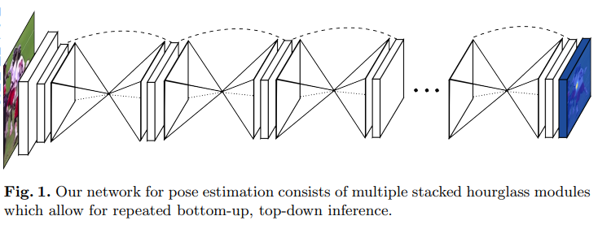

## CenterNet

### 概述

CenterNet是基于anchor free的目标检测算法，和yolo、fast rcnn不同，它没有使用到anchor的技术。也是由于去除了anchor和NMS的后处理操作，所以CenterNet的运行速度会更快。此外，它的精度也比其他one stage、two stage的检测算法要高。

CornerNet虽然实现了利用关键点做物体检测，但CornerNet需要两个角点进行匹配， 匹配过程耗时较长，并且容易出现误检的样本。 而CenterNet算法则将目标检测问题变成了一个关键点的估计问题， 通过预测物体中心点的位置以及对应物体的长宽，实现了检测速度与精度的权衡。

- 该算法去除了anchor的操作，进一步提升了算法的性能；
- 该算法在heatmap上执行力过滤的操作，从而不需要NMS的后处理操作，进一步提升了网络的运行速度；
- 通用性强，可以应用于目标检测、3D目标检测、人体关键点等其他任务中；

### 网络结构

具备三种backbone结构：分别是Resnet-18， DLA-34和Hourglass-104。

以Resnet-18为例，图片首先会缩放至512x512尺寸，其中长边为512，短边进行补0操作，之后变成1x3x512x512的张量送入网络中。首先通过Resnet-18进行特征的提取，尺寸变为1x2048x16x16，然后是进入到三个反卷积模块进行上采样，尺寸变为1x64x128x128，最后送入三个预测分支分别进行预测heatmap（1

xclassx128x128）、目标的宽高（1x2x128x128）以及中心点的偏移（1x2x128x128）。

但有许多代码会将反卷积前的3x3卷积替换为DCNv2（可变形卷积），来提供模型的拟合能力。

Hourglass网络的提出是为了解决人体位姿估计问题，主要思路就是将多个漏斗形状的网络堆叠起来。因为这里左右两边是镜像对称的，也就是左边的模块是右边模块的镜像。模型整体看起来就是先从大到小，再从小到大，看上去就像是个沙漏一样。所以这里用到了max pooling和upsample来进行上采样与下采样。在Hourglass模块中，其实就是由各个残差模块组成的。

DLA-34网络其实是在原始的DLA-34网络基础上进行了修改，加入了更多的残差连接，结合了DenseNet中的密集连接与FPN的思想，前者可以聚合语义信息，来提升模型的识别能力，后者可以聚合空间信息，提高模型的定位能力。

### CenterNet特点

1.没有使用anchor的先验框，而是预测物体的中心点出现位置，所以不会存在先验框与标签的匹配，以及筛选正负样本的过程。 

2.每个物体仅存在一个中心点作为关键点，也看做正样本，具体实现方法是在关键点热图上提取局部峰值点，因此也就不会存在NMS这个过程。 

3.因为CenterNet专注于关键点的检测，因此需要更大的特征图，而不需要使用多个大小不一的特征图。与CornerNet类似，CenterNet尝试了串联Hourglass、ResNet等多种网络用来提取特征，生成了特征点的热图。 但是实验表明，Hourglass的网络能够提供更精确的检测精度，而更轻量的ResNet的检测速度则会更快。 

另外，CenterNet网络中没有Center Pooling操作（相比对Corner Pooling）， 而是把CenterPoint当做关键点来处理， 当中心处响应值最高， 让其上下左右四个位置低些，其余位置为0。 

并且，为了提高中心点的定位精度， 同样也会在每个位置上预测两个偏移。 最终，候选框回归会得到候选框的宽和高。在将点回归到框的过程中， 会选择这个位置上的置信度比其他8个邻域位置置信度都要高的点。 为了提高中心点的定位精度，同样也会在每个位置上预测两个偏移，候选框的宽高通过直接回归得到最后的宽高。

### heatmap的生成

CenterNet是将目标当成一个点来做检测，也就是使用目标box的中心点来代表这个目标，同时预测中心点的偏移量、物体的宽高以及heatmap。heatmap是分类信息，每个类别都有一张heatmap，若某个坐标上有物体的中心点，则这个坐标会产生一个高斯圆。根据目标框的宽高计算高斯圆的半径R，以中心点point为圆心，半径为R进行高斯函数的值填充，也就是中心点处为最大值，沿着半径向外按高斯函数进行递减。

这里的关键点使用的是二维高斯核，因为位于目标中心点的附近一些点，可能预测出来的候选框和ground truth的IOU大于0.7，那么这个时候就不能简单对预测值进行惩罚，而是采用一种温和的方式。所以，当某些矩形框与ground truth的IOU大于0.7的时候，就将这些点设置为高斯分布的值，这些值会比最大值小一些，而不是简单置零。

### 数据增强

这里采用了选取一个中心以及一个目标长宽进行裁剪，然后再进行仿射变换的数据增强操作。

### 损失函数

#### heatmap损失函数

- 在训练过程中，CenterNet得到一个heatmap， 所以加载标签的时候，需要转换为类似的heatmap热图。这里的关键点热图与CornerNet类似，只不过这里是只预测一个中心点的位置。对于标签的处理，CenterNet将标签进行四倍下采样， 然后通过高斯核函数分散到heatmap上，选取局部最大值的那个点。 

  有一个需要注意的点，CenterNet在训练过程中，如果同一个类的不同物体的高斯分布点互相有重叠，那么则在重叠的范围内选取较大的高斯点。 

	并且CenterNet采用了改写后的focal loss，主要防止类别不平衡现象。相比原来的focal loss，负样本loss多加了一个衰减的比值。因为与传统基于anchor的检测算法不同，在训练的过程没有认为IOU大于0.7就为正，小于0.3就为负，也就没有是正例：负例为1:3来减少负例框了，所以CenterNet不通过IOU的重合面积比较，而是通过中心点与周围其他点进行比较，来计算最终的损失。

#### 目标宽高损失函数

- 使用了L1 loss损失函数。因为CenterNet不需要预测Embeddings来处理配对，而是直接预测物体的宽与高，所以这里的预测是原图像素坐标的尺度。 

  也就是说，对于特征图上的一个点，CenterNet会预测C+4个值，其中包括C个类别的中心点得分、中心点(x， y)的偏差以及该物体的宽高(w， h)。与之前的目标检测算法的输出差不多。

#### 中心点偏移损失函数

- 使用了L1 loss，因为在预测分支之前的特征图分辨率是原图像的四分之一，所以输出特征图上的一个像素点对应回原来的图像，就代表4x4区域，将带来比较大的误差，因此引入偏移的补偿。注意的是，所有类别共享同一个偏移预测值。

### 推理阶段

在推理阶段会进行以下操作：

- 将图像缩放至512x512；
- 在heatmap的预测特征图上进行3x3的最大池化操作，来获取满足条件的关键点，并选取前100个关键点，类似NMS操作；
- 根据置信度进行过滤来得到最终的检测结果；

### 网络结构的扩展性

这个思想可以用于多个任务，文章给出了三种类型的例子：

2D目标检测，3D目标检测，人体姿态估计。 

对于2D目标检测，就直接输出类别heatmap，box的宽和高，中心点的x、y坐标偏移。一共为HxWx5。

对于3D目标检测，输出3维的box大小，加上一个1维的深度，和一个8维的方向，方向分为两个部分的方向角，每个方向角用4个标量来表示。其中2个标量用softmax做分类，另外两个做角度回归。一共为HxWx12。

对于人体姿态估计，输出HxWx(3k+2)的feature map，其中kx2是k个关键点离center point的偏移，k是每个关键点的point，2是center point自身关于x、y方向的偏移。在人体姿态估计推理的时候，首先得到k个关键点的位置， 然后根据center point的2k个偏移得到另外一组k个关键点位置，然后判断这k个关键点哪个是哪个类型的关键点，就是找离它最近的那k个关键点其中是哪个，最后应该还是以center point回归得到的点为准。

### 参考链接

https://arxiv.org/pdf/1904.07850.pdf

https://arxiv.org/pdf/1603.06937.pdf

https://arxiv.org/pdf/1707.06484.pdf

