### 背景

我们知道，在过去的目标检测算法中大多数都沿用了anchor box，但是anchor有以下弊端：

- 需要在特征图上平铺大量的anchor box来减少漏检，但是最后只用到了一小部分。为了判断anchor是正样本还是负样本，就需要把anchor和全部标签进行IOU计算，这会导致大量内存资源和运算时间的浪费。
- anchor box引入了额外的超参数以及特别的网络设计，这样一样就使得模型变得复杂，对于不同的任务，都需要额外调节anchor超参数，并且anchor受数量、大小、宽高等因素影响。
- 正负样本的不均衡。因为我们会在整张图像上均匀取点，但是在图像上，大部分区域是不存在物体的，也就是说负样本数目很多，并且这些负样本都是简单的负样本，对于模型来说，不会起到太大的提升效果。

所以，基于以上观点，就有了anchor free的产生。以下是基于anchor free的网络CornerNet。

### CornerNet思想

因为引入anchor的同时也会引入其他问题，并且考虑到anchor会带来正负样本的不均匀，一般来说负样本远远大于正样本，所以CornerNet就抛弃了anchor与RPN，并借鉴了关键点的检测思想，利用关键点来进行检测和匹配。它的大体思路是人体姿态估计的方法Bottom-up：先使用CNN来检测整张图像上的关键点，然后再对属于同一个人的关键点进行拼接，最终形成姿态。

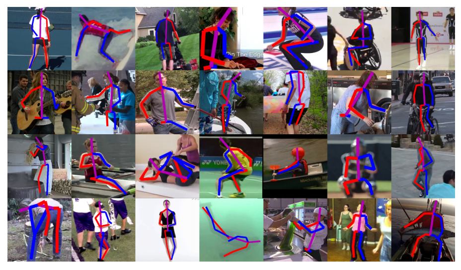

仔细地说是先使用卷积神经网络来检测整个图像中的关键点，然后将这一些关键点进行拼接，形成最终的姿态。 这里的解决思路叫做Bottom-Up，CornerNet将预测所得的左上角与右下角两个角点进行组合。 注意这两个角点是需要属于同一个边框的。

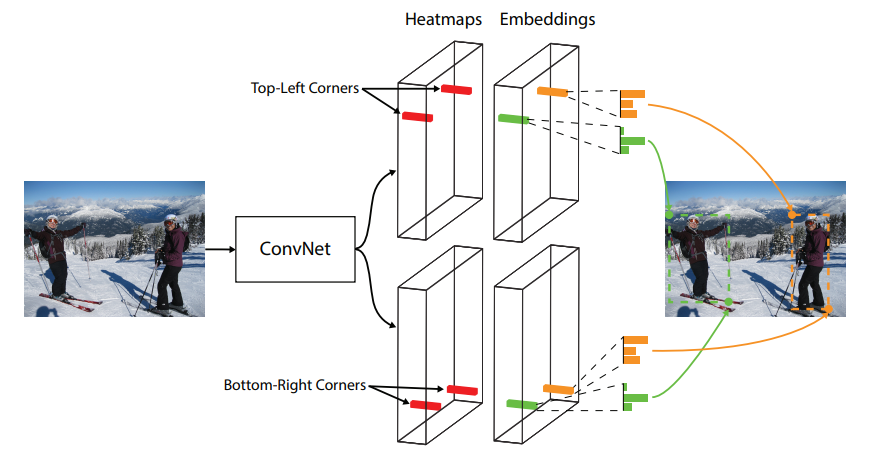

### 算法特点

CornerNet主要由三部分组成： 沙漏结构Hourglass、角点池化、预测输出。

#### 沙漏结构Hourglass

Hourglass是为了提取特征，为后续预测角点提供特征图，它也是网络的骨架，因为它的模型结构长得像沙漏，中间小，两边大，所以就被叫做沙漏结构。

Hourglass是借鉴人体姿态估计的，通过多个Hourglass模块串联在一起，可以有效地提取关键点。在卷积与池化的过程中，特征图的分辨率在不断减小，同时语义信息在不断增加，而在上采样与融合的过程中，深层特征上采样后与浅层的特征进行融合，可以在增大分辨率的同时也保留初始的细节信息。 

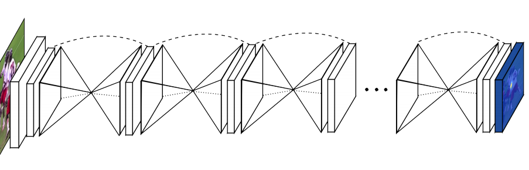

在CornerNet中，首先通过一个步长为2的7×7卷积层，以及经过一个步长为2的残差模块，将图像尺寸缩小为原图的1/4，然后将得到的特征图送入两个串联的Hourglass模块。 在整个Hourglass中，一共有8个Hourglass模块，但是Hourglass模块的权重并不是共享的，而是基于相同的ground truth和损失函数进行调整。

因为Hourglass起初是用于人体姿态，在处理手、脸这些特征的时候需要用到局部信息，而预测人体姿态的时候又需要全局信息，所以为了捕捉不同尺寸下的特征。Hourglass是使用带有skip layers的单个pipeline来保存每个尺度下的空间信息。

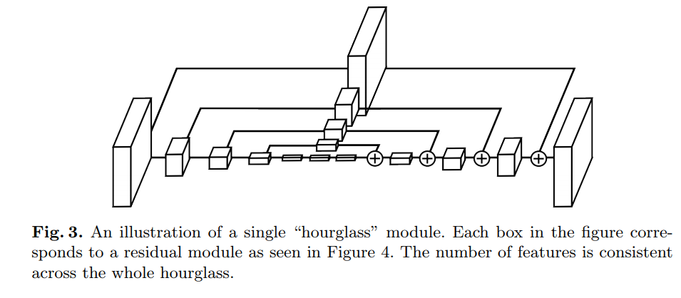

在Hourglass中有许多自底向上和自顶向下的过程，Hourglass关键是用中间监督来对每一个Hourglass模块来进行预测，即对中间的heatmaps计算损失。因为比较高层的特征拥有的分辨率是比较低的，所以如果在网络进行上采样后进行监督，就无法在更大的全局上下文中去重新评估这些特征。

也就是说，如果我们希望Hourglass能够进行最佳的预测，那么这个范围就不应该是一个局部范围。

Hourglass模块整合了局部信息和全局信息，如果需要网络在前期就进行预测，那么只需要它对图片有一个较高层的认知，即使只是整个网络的一部分。

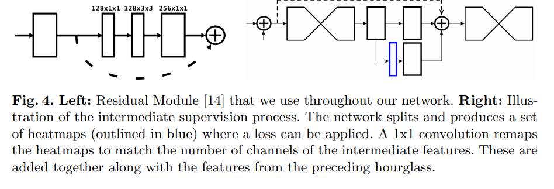

#### 角点池化

角点池化也叫cornner pooling，作为一个特征的池化方式，通过角点池化，可以将物体的信息整合到左上角或者右下角。

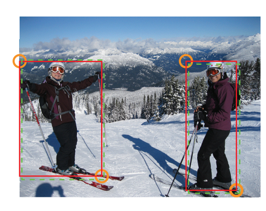

在传统的卷积神经网络中，可以通过池化来进行特征融合和扩大感受野，同时也可以起到缩小特征图尺寸的作用。以3×3的最大池化层为例，通常是以当前位置的点为中心点，融合周围共9个点的信息，取最大值输出。

因为在CornerNet中是利用左上和右下两个关键点进行目标检测，对于一个物体来说，因为在角点部分，只有左上角的右下部分和右下角的左上部分包含了物体的特征。这时，角点的周围就只有四分之一的区域包含了物体信息，其他区域都是背景，那么这个时候使用传统的池化方法就不适用了。 

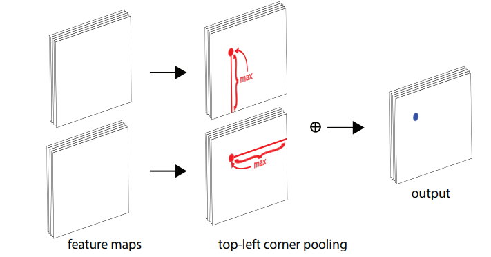

为了达到想要的池化效果，CornerNet作者提出了Corner Pooling的方法，左上点的池化区域是其右侧与下方的特征点， 右下点的池化区域是其左侧与上方的特征点。 假设当前左上点的坐标为（x，y），特征图的尺寸为w， h 则Corner Pooling的计算过程如下： 

1. 计算该点到其下方所有点的最大值，即(x, y)到(x, H)所有点的最大值。 
2. 同理，计算该点到其最右侧所有点的最大值，即(x, y)到(W, y)所有点的最大值。 
3. 完成上述过程后，将这两个最大值进行相加，作为Corner Pooling的输出。
4. 右下点的CornerPooling过程与左上点类似。 

在编码实现时，可以分别从下到上、从右到左来计算最大值，这样效率会更高。 

#### 预测输出

与基于anchor的目标检测算法预测出类别与位置偏移不同，在经过左上角与右下角的Corner Pooling后，紧接着三个预测输出，它们分别是角点出现的位置Heatmaps、角点的配对Embeddings及角点位置的偏移Offsets。 

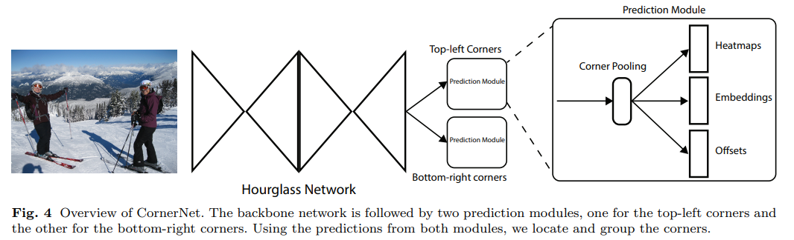

左上角与右下角的cornner pooling池化之后，会输出三个预测，它们分别为：

Heatmaps是角点热力图，是特征图上预测出来的角点位置，大小为CxWxH，C代表类别数。 以左上角点的预测为例，坐标为(c, x, y)代表在特征图上坐标为(x, y)的点是第c个类别物体的左上角角点的分数。

Embeddings，在热力图上，每个角点都是相互独立的，而一个物体需要一对角点，因此Embeddings分支负责将左上角点的分支与右下角点的分支进行匹配，来对同一个物体的角点进行匹配。其大小为1×W×H。

Offsets，第三个预测Offsets代表是偏移，也就是计算时取整丢失的精度。对于小目标来说，取整的丢失对它们影响比较大，因此CornerNet引入了偏差的预测来修正检测框的位置，其大小为2×W×H。

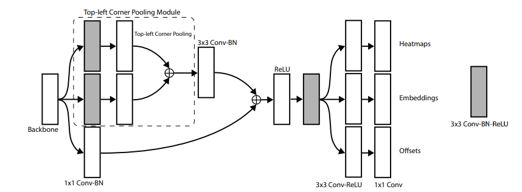

### 损失函数

CornerNet的损失函数由四部分组成：Ldet、Lpull、Lpush、Loff。这4部分损失的含义说明如下： 

#### Ldet

Ldet为角点检测的损失，CornerNet在计算损失时借鉴了Focal Loss的思想，对于不同的正负样本、难易样例给予不同的权重，总体的损失公式为： 

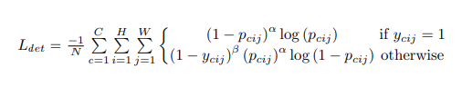

CornerNet为了减小负样本的数量，将以标签的角点为中心，半径为r区域内的点都视为正样本，因为这些点组成的边框与标签会有很大的IOU，所以可能还是我们想要的正样本。

#### Lpull

Lpull是在Embeddings中对于属于同一物体的两个角点的惩罚。提取Embeddings中属于同一个物体的两个角点，然后求其均值，并希望两个角点的值与均值的差值尽可能地小。 

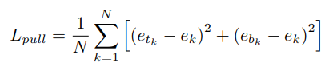

#### Lpush

Lpush是在Embeddings中对不属于同一物体的两个角点的惩罚。计算Lpull中所配对成功的角点的平均值，期望没有匹配到的角点与该平均值的差值尽可能大， 这样可以有效分离无关的角点。 

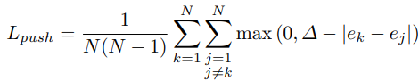

#### Loff

Loff代表位置偏差的损失，这里综合了L1 loss和L2 loss，使用的是smoothL1损失函数来优化这部分位置偏差。

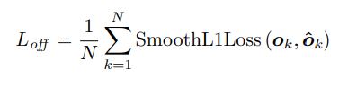

### 文末

总体来看，CornerNet使用了巧妙的方法：它利用了一对关键点来实现目标检测，这样可以避免anchor本身所带来的问题，在检测精度上，相比其他单阶段的检测算法也有一定提升。此外，CornerNet的工作也推动anchor free算法的发展，一系列使用关键点的目标检测算法也应运而生。

### 参考链接

https://arxiv.org/pdf/1808.01244.pdf

https://arxiv.org/pdf/1603.06937.pdf

