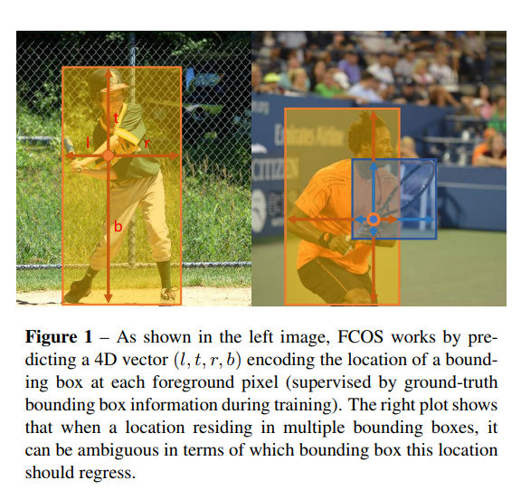
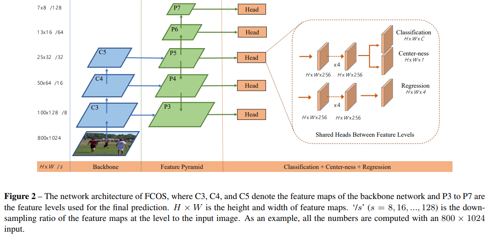
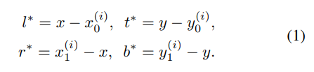
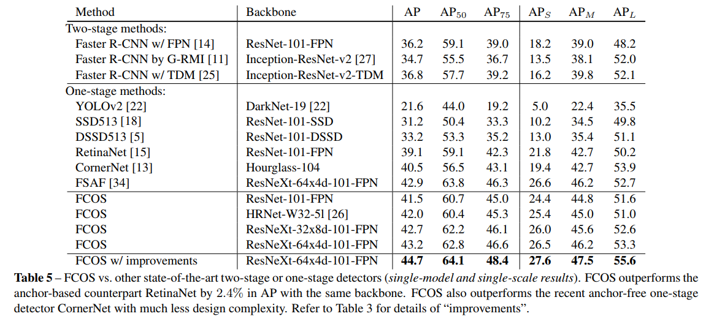
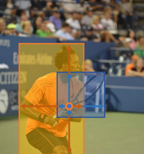
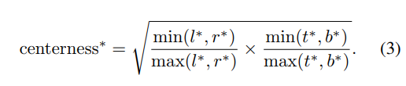
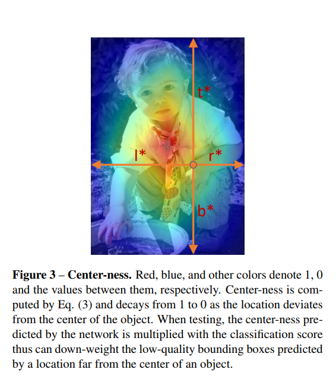
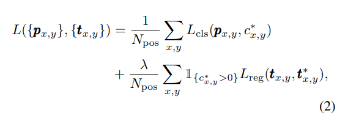

### FCOS简介

FCOS是和CenterNet同年发表的，虽然FCOS是属于anchor free。但是和CornerNet和CenterNet这些基于关键点检测的方法不同，FCOS更像是一个实例分割任务。

FCOS全名叫Fully Convolutional One-Stage Object Detection，也叫全卷积目标检测，它是一种基于像素级、类似实例分割的目标检测算法。

### FCOS思想

FCOS同样隶属于anchor free的算法。虽然说FCOS是anchor free的，但是它也用到NMS。通过消除预先定义的anchor，可以避免与anchor相关的计算，以之减少显存和训练时间，以及避免了去调整那些影响检测性能的anchor超参数。 

FCOS的网络结构为FPN结构，在生成P3~P7的时候，没有在C5上采样得到P6，而是直接用P5采样得到P6。网络最后会输出三个分支，分类分支会输出每个点所属于的类别，回归分支会输出每个点的四个值，分别为l，t，r，b，表示该中心点距离边界框的左侧、右侧、顶部和底部的距离。

FCOS最核心的创新是提出了Center-ness分支，它和局部峰值的思想十分类似。

可以看到，每个检测头输出有三个子分支，分别负责分类、中心度和框回归任务的预测。

其中Classification分类分支的输出大小为: `C * H * W`，C表示类别数（不含背景），每个类别都是二分类；Center-ness中心度估计分支的输出大小为：`1 * H * W`，目的是对目标中心很远的像素点，也就是低质量的点进行抑制；Box Size边框回归分支的输出大小为: `3 * H * W`，对每个特征图的element对应的边界框位置进行预测。

### 逐像素回归预测 

其实在YOLOv1也是没有用anchor，但是在YOLOv1预测边界框时，是使用cell进行回归，导致YOLOv1仅仅预测了目标物体中心点附近的点的边界框。这样作为正样本进行预测的就很少了，召回率也就低了。

FCOS算法为了提升召回率，是对目标物体框内的所有点都进行边界框的预测。这种方法也有弊端，那就是会引入许多质量不高的边界框，但是FCOS为了弥补这个问题，就引入了Center-ness。与YOLOv1不同，FCOS在对目标物体框中所有的点进行坐标回归时，用的是各个边的距离长度来计算损失。之所以使用这种方式，也是因为为了Center-ness处理方便。

由于FCOS算法是基于目标物体框中所有的点进行逐像素回归的，所以，在这过程中进行回归的都属于正样本。 在回归的最后，还会使用exp()将所有回归的目标进行拉伸，使特征空间变得更大，这样一来，目标的辨识度也会更高。

传统的anchor base算法，只是将具有高重叠的anchor box作为正样本，而FCOS的逐像素回归虽然会引入更多低质量的框，但是它也利用了尽量多的前景信息来训练回归器。所以，这也可能是FCOS比其它基于anchor的检测器性能好的的原因。

### 多尺度策略

因为FCOS中用到了FPN的结构，所以在推理时，可以拟定多尺度的策略。和大多数的多尺度策略类似，对于anchor base的目标检测算法，较大的降采样会导致漏检，这导致的漏检可以通过降低正样本所需的IOU分数来缓解，以此来提高召回率。

然而对于FCOS算法，由于没有anchor，如果降采样的尺度过大，那么网络就不能恢复该对象在原始图像上的边框，因为特征图上是没有位置编码的。对此，作者提出了基于FPN的多尺度策略。

考虑到P2特征层太大了，所以FCOS算法只使用了P3，P4，P5，P6，P7这五个尺度的特征层。其中P6和P7是进行两个特征层融合后再进行上采样的结果。这里更浅层的特征P3更加适合小目标的检测，而更深层次的特征P7就更加适合大目标的检测。最终对这五个尺度的特征层上的点逐一做回归。

为了能更好地利用这一些多尺度信息，在每一个尺度的特征层都限定了边界框回归的范围。这样，当有重叠现象发生时，FPN的分级预测机制也可以很大程度将重叠的目标分到不同的检测头上进行预测，这样就不会相互干扰。

### Center-ness 

因为FCOS算法使用了逐像素回归，虽然可以提升召回率的，但是会产生许多中心点偏移较多的低质量预测边界框。 所以FCOS提出了Center-ness来抑制所检测到的低质量边界框，并且该策略有一个优点，就是不会引入任何超参数。

在特征图上，每个点都会输出一个预测框，但是并不是每个点都能够代表一个正例。也就是即便某些像素点虽然在目标框中，但是却是背景，因为这些点离目标的中心点很远，这类特征图的点就被称为低质量点。为了抑制这类低质量点所产生的预测框，将所有点的类别概率乘以Center-ness，最后得到的分数就当做最终的类别置信度。

在Center-ness中，每一个层级预测时都会加入了一个分支，这个分支和分类是并行的，相当于给网络添加了一个损失，而该损失保证了预测的边界框尽可能的靠近中心。简单来说，就是FCOS会添加单分类分支，与多分类分支并行，来预测Center-ness的位置。

边界框的中心处响应值最高，随后向周围扩散时，依次降低，值的范围在0~1之间。在Center-ness 分支中每个特征层位置上的值，是根据回归得到的(l, t, r, b)来计算的。很显然，越是中间位置，Center-ness的值就越高，越偏离中心处，Center-ness值就会越低。

它这里是取乘积最大值对应的类别作为预测结果，如果所有类别的概率值乘以Center-ness的结果都比阈值低，那么该点的分类结果就为负例，否则为正例。

可以把Center-ness当做一种具有度量作用的方法，在这里称之为中心度，中心度的取值在0,1之间。在训练时，使用的是交叉熵损失，并且会把损失加入前面的损失函数中；而在测试时，会将预测的中心度与相应的分类分数相乘，得到最终的计算得分，这里是用于对检测到的边界框进行排序。

所以，中心度可以降低那些远离对象中心的边界框的权重。此外，这些低质量的边界框也可能会被NMS所过滤掉，这样就可以在提升召回的情况下，减少误检。

### 损失函数

FCOS的损失函数分为3个部分：

#### Classification Loss

分类损失Classification Loss采用Focal Loss，借鉴了RetinaNet，可以解决正负样本不均衡和难易样本不均衡的问题。

#### Regression Loss

边框回归损失Regression Loss采用IOU Loss，这里是将边界框四个值作为一个整体去进行损失的计算。

#### Center-ness Loss

中心度预测损失Center-ness Loss采用BCE Loss

### FCOS的优缺点

#### 优点

- 采用anchor free，减少了计算量、参数量和内存占用；
- FCOS迁移性强，可以很容易迁移到其他任务中；
- FCOS结构简洁，准确性能也高；
- FCOS使用用目标整个区域的点作计算以及运用了Center-ness，在提高召回的同时，能够保持较高的准确率；

#### 缺点

- 使用点来进行训练，不容易收敛；
- FCOS的Center-ness分支和Classification分支在训练时，是没有交互关系的，但是在推理的时候直接相乘作为分数，对框质量的预测效果仍有上升空间；
- 对大小差不多的重叠物体检测效果不好，模型依旧会合并为同一个bbox；

### 文末

FCOS是一个基于FCN的逐像素计算、anchor free的one-stage目标检测算法。因为FCOS抛弃了传统的目标检测思路，所以与其说FCOS是目标检测算法，不如说它是语义分割的任务。它不仅避免了所以和anchor box相关的计算，还使用逐像素计算的方法缓解目标检测低召回的问题。

### 参考链接

https://arxiv.org/pdf/1904.01355.pdf

