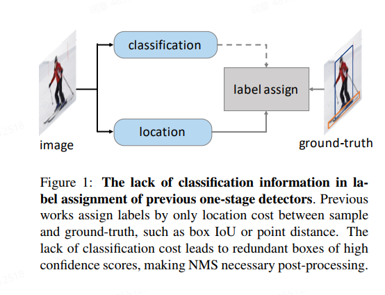
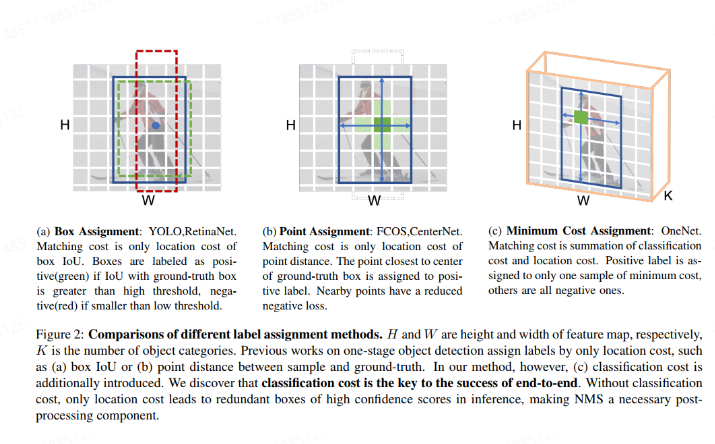
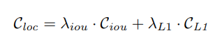
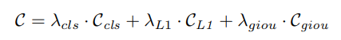
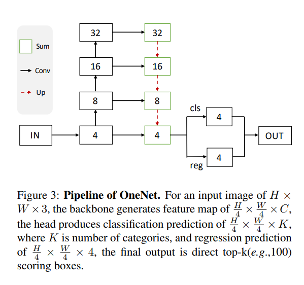
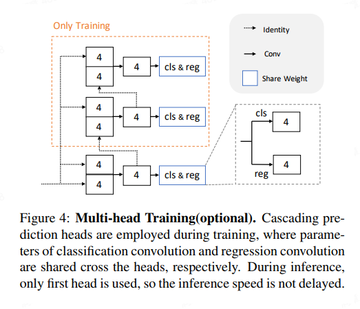
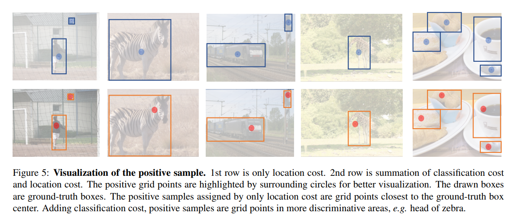

### 背景

在目标检测中，通常会把候选框与ground truth的IOU大于阈值的看做正样本，这是基于边界框分配。另一类则是不需要预先设定锚框，而是直接将特征图上的点作为训练样本。这时，标签分配则是根据点到框各边界的距离而定，这被叫做基于点分配。

但是这两种方法都有一个共同的问题，就是存在“多对一”的问题，对于一个ground truth，可能有超过一个正样本匹配。这样会使得模型的性能对于超参数十分敏感，而且容易产生冗余框，那么就需要使用NMS后处理进行过滤。

针对这一问题，就出现了一对一的匹配方法，进行单一配对后，希望就不需要用到NMS。但是直接使用的话还是会出现冗余的框，分析之后发现，在进行标签分配时，缺少了分类损失，因此在后续需要将这个加入进来。除此之外，OneNet还设计了一个简单的标签分配策略，叫做Minimum Cost Assignment，简单来说，就是对于每个ground truth，只有一个具有最小的分类和定位损失的样本被分配为正样本。

### OneNet思想

因为传统的基于anchor的目标检测方法存在每个ground truth会有多个预测框的问题，需要NMS这些后处理来解决，这里就将一对多的分配规则修改为一对一。并且在之前的标签分类上，只基于了位置的损失，而没有考虑分类的损失，所以会出现大量的高分冗余框；并且之前的标签分类需要人为设置，从而引入了超参数。

在端到端的目标检测中，主要的阻碍是在于标签分配，因为在做标签分配的时候，只是通过位置来匹配，而没有使用到分类的信息，那么模型在推理的过程中，可能会出现高置信度的冗余的框，还是需要在后处理的时候使用NMS。

OneNet提出了一种方法，对于一个ground truth只分配一个正样本，剩余的其它都为负样本。并且由于OneNet为anchor free算法， 所以不需要NMS。

### OneNet结构

- backbone使用resnet+FPN，最后输出一张特征图，尺寸宽高为原来的四分之一；
- head使用两个并行的分支，分别进行分类与回归；分类分支预测分类结果，回归分支预测中心点到4个边界框的距离；
- 训练时标签的分配采用最小损失方法，训练损失和匹配损失类似，包括Focal Loss，L1 Loss， GIOU Loss；
- 推理时直接输出TopK个结果，并按得分进行排序；不需要进行NMS、池化的后处理；

### OneNet优点

1. 使用了全卷积的结构以及端到端的结构，没有使用ROI、注意力机制；
2. 标签的分配除了定位损失，还加入了分类的损失，租后计算基于两者之和的最小损失；
3. 标签匹配策略为一对一，即一个ground truth只有一个正样本，其他都为负样本；
4. 不需要NMS、池化的这些后处理；

### 标签的分配

以往的标签分配只有定位损失，是基于IOU或者点的距离来进行匹配的，比如基于anchor的IOU损失，或者类似centernet这些基于中心点距离的损失。但是发现只使用定位损失会导致较高置信度的冗余框出现，导致需要NMS的后处理。因为目标检测是个多任务，当中既有回归又有分类，所以不应该只使用到位置损失，否则会导致出现高置信度的冗余框，导致后处理的时候需要NMS。因此，在OneNet中就把分类损失引入匹配损失中。

定位损失使用L1 Loss，分类损失使用softmax；在dense的检测器中，定位损失使用L1 Loss以及GIOU Loss，分类损失使用Focal Loss。

并且这里对每一个ground truth，只分配最小cost的样本为正样本，其他都为负样本。

### 训练的策略

1.  定位分支与分类分支共享权重，因为实验发现配置多head训练无法带来精度的提升，反而会降低速度。

2.  在第一阶段，在通道数上广播两次，那么输入特征F0由H/4 × W/4 × C广播为H/4 × W/4 × 2C，然后经过卷积运算后得到H/4 × W/4 × C的输出特征F1。基于F1，分类的预测和回归的预测就生成了。在后续阶段j中，将原始大小为将H/4 × W/4 × C的输入特征F0与前一阶段大小为H/4 × W/4 × C的特征Fj−1在通道上进行拼接，得到输出大小为H/4 × W/4 × 2C大小的输出特征。然后Fj就再次根据连接起来的特征再次得到分类分支和回归分支，变成H/4 x W/4 x C。

   

3. 使用了级联机制以及共享权重，可以直接提高学习率稳定训练并同时提高精度，增加模型性能。

4. 推理的时候只使用第一个阶段，其他阶段都被抛弃。在稍微减少精度的情况下，可以减少计算量，提高推理速度。

### 正样本的可视化

在CenterNet中，正样本基本位于ground truth中心的网格点上，这样是比较有益于框的回归，但是在处理正负样本的分类上并不是最优的选择，如第二列图片，第一排是CenterNet的框，第二排是OneNet的框。由于斑马身体扭曲了，所以导致了网格点定位到了它的身体上，虽然整体上来看没有问题，但这其实并不是特征区分最明显的位置。而对于OneNet，可以看到，正样本定位到了它的头上，是最具特征区分性的地方。

### 文末

针对标签分配“多对一”的问题，OneNet提出的解决方案是每个ground truth只对应一个预测结果。同时，如果只考虑定位损失，那么分类分支会强制输出符合优化定位任务的结果，那么就导致高置信度冗余框的出现。虽然只基于定位损失的标签分配应用广泛，但是在OneNet中发现正是这一点成为了端到端目标检测算法提升的主要障碍。

原因在于标签分配与网络优化之间的不一致。目标检测是一个包含分类与定位的多任务模型，基于定位损失得到的正样本只能保证定位任务的优化，而无法保证分类任务的优化。

以上就是笔者对OneNet的理解，其实类似的还有CornerNet、CenterNet、FCOS等等，这些非传统的目标检测正在崛起。虽然这篇论文不算太热门，但我想藉着这一些方法来拓展自己的视野，让自己保持对技术的敏感、好奇。

### 参考链接

https://arxiv.org/pdf/2012.05780v1.pdf

https://arxiv.org/pdf/2012.05780.pdf

